# 📑 Laporan Penelitian Ilmiah: Alternatif 4
# Interpretasi Fitur Universal Berbasis SHAP (SHapley Additive exPlanations): Mengungkap Faktor Penentu Flakiness Lintas Proyek vs Dalam Proyek

**Mata Kuliah**: Rekayasa Perangkat Lunak A  
**Program Studi**: Magister Teknik Informatika — Institut Teknologi Sepuluh Nopember (ITS)  
**Kelompok Peneliti**: Kelompok A01 (Bima Jati Kusuma dkk.)  
**Tanggal Eksekusi**: 11 Oktober 2026  
**Hardware Akselerasi**: Laptop GPU NVIDIA GeForce RTX 4050 (6GB GDDR6 VRAM, CUDA 13.4, Driver 617.42)  
**Dataset Utama**: FlakeFlagger Benchmark (22.236 test cases dari 24 repositori Java, Pembersihan C1: 21.963 baris valid)  
**Dokumen Induk**: [`../../Rencana_Penelitian_Flaky_Test.md`](../../Rencana_Penelitian_Flaky_Test.md)  

---

## 📌 1. Ringkasan Eksekutif (Executive Summary)

Model Machine Learning (ML) untuk deteksi pengujian tidak konsisten (*Flaky Test Prediction*) kerap diperlakukan sebagai sistem *black box*. Dalam praktik rekayasa perangkat lunak modern, para pengembang (*developers*) dan *test engineers* tidak hanya memerlukan skor probabilitas numerik bahwa suatu pengujian berpotensi *flaky*, melainkan menuntut pemahaman kausalitas yang transparan: **Fitur apa yang mendorong pengujian ini menjadi flaky? Apakah indikator tersebut bersifat universal lintas repositori atau hanya artefak lokal proyek tertentu?**

Pada studi seminal FlakeFlagger (*Alshammari et al., ICSE 2021*), model dievaluasi secara *Within-Project* (data latih dan uji berasal dari proyek yang sama), di mana fitur waktu eksekusi (`ExecutionTime`) dan ukuran kode dilaporkan sangat dominan. Namun, pada investigasi skala besar *Cross-Project Flaky Test Prediction* (*Afeltra et al., IEEE Access 2024*), terjadi fenomena degradasi performa model yang masif akibat *domain shift*. Muncul hipotesis empiris krusial: *Apakah fitur yang sama tetap menjadi prediktor paling universal dalam skenario lintas proyek? Ataukah fitur kategori Test Smells (seperti fire-and-forget, indirect-testing, resource-optimism) yang secara semantik tidak tergantung pada skala proyek menjadi jauh lebih penting dan naik peringkatnya ketika model diuji lintas proyek?*

Studi Lanjutan Alternatif 4 menerapkan kerangka teori permainan kooperatif **SHAP (SHapley Additive exPlanations)** melalui algoritma **TreeExplainer** (*Lundberg & Lee, NeurIPS 2017*) untuk membongkar kontribusi 23 fitur FlakeFlagger secara rigor pada dua arsitektur ensemble pohon: **XGBoost GPU Classifier** (diakselerasi CUDA 13.4 pada RTX 4050) dan **Random Forest Classifier** (100 estimators multi-core). Evaluasi dilakukan secara komparatif antara skenario **Within-Project Pooled CV (10-Fold)** dan **Cross-Project Leave-One-Project-Out Cross-Validation (24-Fold LOPO-CV)** pada seluruh 21.963 unit test dari 24 repositori Java open-source tanpa data leakage.

### 🌟 Temuan Kunci Penelitian (Key Empirical Findings):
1. **Fitur Universal Teratas (Top Universal Predictor)**:
   - **`ExecutionTime`** terbukti secara absolut menjadi prediktor flakiness paling dominan dan universal di seluruh skenario. Fitur ini menyumbang **26,75%** dari total kontribusi SHAP pada Cross-Project ($E[|\text{SHAP}|] = 1,1519$) dan **26,31%** pada Within-Project ($E[|\text{SHAP}|] = 1,1330$).
   - Prediktor universal berikutnya adalah riwayat modifikasi jangka menengah **`hIndexModificationsPerCoveredLine_window100`** (**9,24%**, rank #2) serta ukuran kode proyek yang dieksekusi: **`projectSourceClassesCovered`** (**9,02%**, rank #3) dan **`projectSourceLinesCovered`** (**7,61%**, rank #4).
2. **Korelasi Peringkat Fitur yang Sangat Konsisten**:
   - Uji korelasi peringkat Spearman antara Within-Project dan Cross-Project menghasilkan koefisien **$\rho = 0,9704$ ($p = 1,98 \times 10^{-14}$)** dengan korelasi nilai SHAP Pearson **$r = 0,9932$ ($p = 4,31 \times 10^{-21}$)**. Hal ini menolak dugaan bahwa hierarki kepentingan fitur bergeser secara radikal lintas proyek, namun memvalidasi adanya pergeseran lokal (*local rank shift*) yang signifikan.
3. **Dinamika Pergeseran Peringkat (Rank Shift Dynamics)**:
   - **Kenaikan Metrik Riwayat Modifikasi Jangka Panjang**: Fitur `hIndexModificationsPerCoveredLine_window10000` melesat naik **$+4$ peringkat** (dari posisi #10 pada Within ke posisi #6 pada Cross-Project, kontribusi melonjak dari 3,67% menjadi 4,89%).
   - **Kenaikan Dependensi Eksternal**: Fitur `num_third_party_libs` melompat naik **$+3$ peringkat** (dari #12 ke #9, kontribusi naik dari 3,15% ke 4,03%), membuktikan bahwa pengujian yang bergantung pada banyak library pihak ketiga memiliki risiko flakiness eksternal yang lebih tinggi saat dievaluasi lintas ekosistem.
   - **Pergeseran Kategori Test Smells**: Uji hipotesis menunjukkan bahwa kontribusi kumulatif Test Smells stabil pada **10,07%** (Cross) vs **10,01%** (Within). Di antara 8 smell, **`fire-and-forget`** merupakan smell paling dominan (rank #11, 3,26%), disusul oleh **`indirect-testing`** (rank #15, 2,11%). Sementara itu, **`mystery-guest`** mengalami kenaikan peringkat **$+2$** (dari #19 ke #17).
4. **Validasi Silang Arsitektur Model (XGBoost GPU vs Random Forest)**:
   - Analisis SHAP pada model Random Forest mengonfirmasi temuan XGBoost: empat fitur teratas tetap didominasi oleh `projectSourceClassesCovered` (15,27%), `projectSourceLinesCovered` (12,08%), `ExecutionTime` (11,32%), dan `numCoveredLines` (7,20%), dengan `fire-and-forget` memimpin kategori Test Smells.
5. **Efisiensi Akselerasi GPU RTX 4050 (CUDA 13.4)**:
   - Pelatihan dan ekstraksi nilai SHAP TreeExplainer pada XGBoost GPU untuk seluruh 24 fold LOPO-CV (21.963 instans) tuntas hanya dalam **4,96 detik** (rata-rata 0,20 detik per fold) dengan alokasi VRAM stabil di ~1.011 MB.
   - Sebagai komparasi, Random Forest CPU memerlukan **365,12 detik** untuk LOPO-CV dan **460,14 detik** untuk Pooled CV. Akselerasi GPU memberikan **efisiensi waktu komputasi hingga 73,6x - 107,7x lebih cepat**.

---

## 🔬 2. Landasan Teori & Formulasi Matematis SHAP

### 2.1 Teori Permainan Kooperatif & Nilai Shapley (*Shapley Values*)
SHAP (*SHapley Additive exPlanations*) yang diperkenalkan oleh Lundberg & Lee (NeurIPS 2017) berakar pada konsep pembagian keuntungan yang adil dalam teori permainan kooperatif (*cooperative game theory*, Shapley 1953).

Misalkan $F$ adalah himpunan seluruh $M$ fitur input ($|F| = M$), dan $S \subseteq F$ adalah sembarang subset fitur tanpa fitur $i$ ($i \notin S$). Kontribusi marjinal fitur $i$ terhadap prediksi model $f(x)$ didefinisikan sebagai rata-rata tertimbang selisih ekspektasi output model saat fitur $i$ disertakan versus ditiadakan:

$$\phi_i(x) = \sum_{S \subseteq F \setminus \{i\}} \frac{|S|! (|F| - |S| - 1)!}{|F|!} \left[ f_x(S \cup \{i\}) - f_x(S) \right]$$

Di mana:
- $\phi_i(x)$ adalah nilai Shapley (*SHAP value*) untuk fitur $i$ pada instance uji $x$.
- $|S|! (|F| - |S| - 1)! / |F|!$ adalah faktor pembobotan kombinatorik yang mencerminkan probabilitas permutasi subset $S$.
- $f_x(S) = \mathbb{E}[f(X) \mid X_S = x_S]$ adalah nilai ekspektasi prediksi model terkondisi pada subset fitur $S$.

### 2.2 Sifat Fondasional SHAP (*Axiomatic Properties*)
Nilai Shapley menjamin 3 aksioma matematis yang tidak dipenuhi oleh metode feature importance heuristik lainnya (seperti Gini Impurity atau Gain Importance):
1. **Efisiensi Lokal (*Local Accuracy / Efficiency*)**:
   $$f(x) = \phi_0 + \sum_{i=1}^M \phi_i(x)$$
   Jumlah dari seluruh nilai SHAP fitur ditambah nilai dasar (*base value* $\phi_0 = \mathbb{E}[f(X)]$) tepat merekonstruksi output prediksi log-odds model $f(x)$.
2. **Ketiadaan Efek (*Missingness / Null Player*)**:
   Jika suatu fitur $x_i$ tidak memberikan kontribusi marjinal terhadap sembarang subset ($f_x(S \cup \{i\}) = f_x(S)$ untuk semua $S$), maka $\phi_i(x) = 0$.
3. **Konsistensi (*Consistency*)**:
   Jika sebuah model diubah sedemikian rupa sehingga kontribusi marjinal fitur $i$ selalu lebih besar atau sama untuk semua subset, maka nilai SHAP $\phi_i(x)$ tidak akan pernah menurun.

### 2.3 Algoritma TreeExplainer untuk Model Berbasis Pohon
Untuk model ensemble pohon seperti XGBoost dan Random Forest, komputasi eksak nilai Shapley secara naif membutuhkan kompleksitas eksponensial $\mathcal{O}(M 2^{|F|})$. Algoritma **TreeExplainer** mengeksploitasi struktur graf pohon keputusan biner untuk mereduksi kompleksitas menjadi polinomial:

$$\mathcal{O}(T L D^2)$$

Di mana:
- $T$ adalah jumlah pohon dalam ensemble ($T = 100$).
- $L$ adalah jumlah daun maksimum per pohon.
- $D$ adalah kedalaman pohon (*maximum depth*, $D = 6$ pada konfigurasi XGBoost GPU).

Dengan $D = 6$, komputasi nilai Shapley untuk 21.963 instans pengujian berlangsung dalam orde detik pada arsitektur GPU CUDA.

---

## 📊 3. Desain Metodologi & Protokol Eksperimen

```
FlakeFlagger Dataset (22.236 baris, 24 Proyek)
       │
       ▼
Strategi Pembersihan C1 (Row-Level Drop) ──► 21.963 Baris Data Valid
       │
       ├─────────────────────────────────────────┐
       ▼                                         ▼
Skenario A: Within-Project Pooled CV      Skenario B: Cross-Project LOPO-CV
(10-Fold Stratified Cross-Validation)     (24-Fold Leave-One-Project-Out)
       │                                         │
       ├───────────────────┐                     ├───────────────────┐
       ▼                   ▼                     ▼                   ▼
XGBoost GPU        Random Forest         XGBoost GPU        Random Forest
TreeExplainer       TreeExplainer        TreeExplainer       TreeExplainer
       │                   │                     │                   │
       ▼                   ▼                     ▼                   ▼
SHAP Values         SHAP Values          SHAP Values         SHAP Values
(N=21.963)          (N=21.963)           (N=21.963)          (N=21.963)
       │                   │                     │                   │
       └───────────────────┴──────────┬──────────┴───────────────────┘
                                      ▼
                        RankComparator & Visualizer
                        - Spearman Rank Correlation (ρ)
                        - Rank Shift Dynamics (ΔRank)
                        - Taxonomy Contribution (Smells vs Coverage vs Churn)
                        - Local Explanations (spring-boot Waterfall)
                        - Dependence Plots (Inflection Points / Risk Thresholds)
```

### 3.1 Dataset Benchmark FlakeFlagger & Pembersihan C1
Dataset yang digunakan berasal dari korpus resmi FlakeFlagger (*Alshammari et al., ICSE 2021*), mencakup 24 repositori Java open-source ternama (`spring-boot`, `wildfly`, `hbase`, `okhttp`, `activiti`, dll.).
- **Jumlah data mentah**: 22.236 test cases.
- **Strategi Pembersihan C1**: Dilakukan penghapusan baris dengan nilai kosong (*missing values*) pada 23 fitur prediktif, menghasilkan **21.963 baris data valid** (tingkat kelengkapan 98,77%).
- **Distribusi Kelas**: 808 test cases flaky (3,68%) dan 21.155 test cases non-flaky (96,32%), mencerminkan ketidakseimbangan kelas (*severe class imbalance*) alami pengujian perangkat lunak.

### 3.2 Taksonomi 23 Fitur Prediktif
Seluruh 23 fitur dikelompokkan ke dalam 3 dimensi taksonomi konseptual:
1. **Dimensi 1: Test Smells (8 fitur biner)**:
   - `assertion-roulette`: Unit test dengan multi-asersi tanpa pesan penjelasan.
   - `conditional-test-logic`: Unit test yang mengandung struktur percabangan (`if`/`switch`/`for`).
   - `eager-test`: Unit test yang menguji terlalu banyak metode produksi sekaligus.
   - `fire-and-forget`: Unit test yang mengeksekusi operasi asinkron tanpa menunggu penyelesaian.
   - `indirect-testing`: Unit test yang menguji kelas produksi melalui kelas perantara.
   - `mystery-guest`: Unit test yang menggunakan sumber daya eksternal tak kasat mata (file/DB).
   - `resource-optimism`: Unit test yang mengasumsikan ketersediaan sumber daya sistem.
   - `test-run-war`: Unit test yang bersaing memperebutkan resource yang sama dalam eksekusi paralel.
2. **Dimensi 2: Execution & Coverage (7 fitur metrik absolut)**:
   - `ExecutionTime`: Durasi eksekusi unit test (dalam detik).
   - `testLength`: Jumlah baris kode pada metode pengujian.
   - `numAsserts`: Jumlah pernyataan asersi dalam unit test.
   - `numCoveredLines`: Jumlah baris kode produksi yang dieksekusi oleh unit test.
   - `projectSourceLinesCovered`: Total baris kode proyek yang ter-cover.
   - `projectSourceClassesCovered`: Total kelas kode proyek yang ter-cover.
   - `num_third_party_libs`: Jumlah dependensi pustaka pihak ketiga yang digunakan.
3. **Dimensi 3: Code Churn (8 fitur riwayat modifikasi `hIndex`)**:
   - `hIndexModificationsPerCoveredLine_window5` hingga `window10000`: Metrik intensitas modifikasi historis baris kode produksi yang ter-cover pada rentang commit 5, 10, 25, 50, 75, 100, 500, dan 10.000 commit terakhir.

### 3.3 Protokol Validasi Zero Test-Leakage
1. **Skenario Within-Project (Pooled CV)**: 10-Fold Stratified Cross-Validation pada 21.963 baris. Pada setiap fold, model dilatih pada 90% data dan nilai SHAP dihitung secara eksklusif pada 10% data uji out-of-fold.
2. **Skenario Cross-Project (LOPO-CV)**: 24-Fold Leave-One-Project-Out. Model dilatih pada 23 repositori sumber dan diuji pada 1 repositori target yang belum pernah dilihat sama sekali.
3. Seluruh matriks nilai SHAP dikompilasi hingga merepresentasikan ke-21.963 baris secara utuh tanpa ada sampel yang bocor ke fase pelatihan.

---

## 📈 4. Hasil Eksperimen & Analisis Komparatif

### 4.1 Tabel Komparasi Peringkat Fitur Lengkap: Within-Project vs Cross-Project (XGBoost GPU)

Tabel berikut menyajikan nilai Mean Absolute SHAP ($E[|\text{SHAP}|]$), persentase kontribusi relatif terhadap total penjelasan model, peringkat kepentingan, serta pergeseran peringkat ($\Delta\text{Rank} = \text{Rank}_{\text{Within}} - \text{Rank}_{\text{Cross}}$). Nilai $\Delta\text{Rank} > 0$ menandakan fitur naik peringkatnya (menjadi lebih penting) pada skenario Cross-Project.

| No | Nama Fitur | Dimensi Taksonomi | Within $|SHAP|$ | Within Rank | Within Share (%) | Cross $|SHAP|$ | Cross Rank | Cross Share (%) | Rank Shift ($\Delta\text{Rank}$) |
|:--:|:---|:---|:---:|:---:|:---:|:---:|:---:|:---:|:---:|
| 1 | **`ExecutionTime`** | Execution & Coverage | **1,132955** | **1** | 26,31% | **1,151869** | **1** | **26,75%** | **0** (Konsisten #1) |
| 2 | **`hIndex..._window100`** | Code Churn | 0,398401 | 2 | 9,25% | 0,397969 | 2 | 9,24% | **0** (Konsisten #2) |
| 3 | **`projectSourceClassesCovered`** | Execution & Coverage | 0,312048 | 4 | 7,25% | 0,388497 | 3 | 9,02% | **+1** (Naik) |
| 4 | **`projectSourceLinesCovered`** | Execution & Coverage | 0,337340 | 3 | 7,83% | 0,327772 | 4 | 7,61% | -1 |
| 5 | **`hIndex..._window10`** | Code Churn | 0,241410 | 5 | 5,61% | 0,212908 | 5 | 4,95% | **0** |
| 6 | **`hIndex..._window10000`** | Code Churn | 0,158223 | 10 | 3,67% | 0,210636 | 6 | 4,89% | **+4** (Lonjakan Masif) |
| 7 | **`numCoveredLines`** | Execution & Coverage | 0,205963 | 7 | 4,78% | 0,198281 | 7 | 4,61% | **0** |
| 8 | **`testLength`** | Execution & Coverage | 0,201397 | 8 | 4,68% | 0,174472 | 8 | 4,05% | **0** |
| 9 | **`num_third_party_libs`** | Execution & Coverage | 0,135466 | 12 | 3,15% | 0,173597 | 9 | 4,03% | **+3** (Ketergantungan Eksternal) |
| 10 | **`hIndex..._window50`** | Code Churn | 0,206477 | 6 | 4,80% | 0,160994 | 10 | 3,74% | -4 |
| 11 | **`fire-and-forget`** | Test Smells | 0,136857 | 11 | 3,18% | 0,140195 | 11 | 3,26% | **0** (Smell Teratas) |
| 12 | **`hIndex..._window500`** | Code Churn | 0,187970 | 9 | 4,37% | 0,139583 | 12 | 3,24% | -3 |
| 13 | **`numAsserts`** | Execution & Coverage | 0,125575 | 13 | 2,92% | 0,104744 | 13 | 2,43% | **0** |
| 14 | **`hIndex..._window75`** | Code Churn | 0,089002 | 15 | 2,07% | 0,093104 | 14 | 2,16% | **+1** |
| 15 | **`indirect-testing`** | Test Smells | 0,091915 | 14 | 2,13% | 0,091005 | 15 | 2,11% | -1 |
| 16 | **`hIndex..._window25`** | Code Churn | 0,087741 | 16 | 2,04% | 0,090109 | 16 | 2,09% | **0** |
| 17 | **`mystery-guest`** | Test Smells | 0,042833 | 19 | 0,99% | 0,051341 | 17 | 1,19% | **+2** (Smell Naik) |
| 18 | **`test-run-war`** | Test Smells | 0,057787 | 17 | 1,34% | 0,050249 | 18 | 1,17% | -1 |
| 19 | **`hIndex..._window5`** | Code Churn | 0,054943 | 18 | 1,28% | 0,047264 | 19 | 1,10% | -1 |
| 20 | **`assertion-roulette`** | Test Smells | 0,041004 | 20 | 0,95% | 0,042232 | 20 | 0,98% | **0** |
| 21 | **`resource-optimism`** | Test Smells | 0,035712 | 21 | 0,83% | 0,030491 | 21 | 0,71% | **0** |
| 22 | **`eager-test`** | Test Smells | 0,022180 | 22 | 0,52% | 0,025055 | 22 | 0,58% | **0** |
| 23 | **`conditional-test-logic`** | Test Smells | 0,002827 | 23 | 0,07% | 0,003151 | 23 | 0,07% | **0** |
| **TOTAL** | — | — | **4,306025** | — | **100,00%** | **4,305518** | — | **100,00%** | — |

> [!NOTE]
> **Total Nilai Ekspektasi SHAP**: Total mean absolute SHAP pada kedua skenario hampir identik secara presisi ($4,3060$ vs $4,3055$), membuktikan kestabilan matematis kalibrasi log-odds model ensemble pohon saat dievaluasi out-of-fold.

---

### 4.2 Uji Hipotesis & Analisis Korelasi Statistik

#### 1. Uji Korelasi Peringkat Spearman ($\rho$)
- **Koefisien Korelasi Spearman**: $\rho = 0,9704$
- **Signifikansi Statistik**: $p\text{-value} = 1,9754 \times 10^{-14}$ (Sangat signifikan, $p < 0,001$).
- **Interpretasi**: Terdapat korelasi monotonik positif yang sangat kuat dan kokoh antara urutan pentingnya fitur pada skenario Within-Project dan Cross-Project. Fitur yang penting dalam mendeteksi flakiness di dalam sebuah proyek pada dasarnya tetap memegang peranan krusial ketika model diuji pada repositori baru.

#### 2. Uji Korelasi Nilai Absolut Pearson ($r$)
- **Koefisien Korelasi Pearson**: $r = 0,9932$
- **Signifikansi Statistik**: $p\text{-value} = 4,3079 \times 10^{-21}$ ($p < 10^{-20}$).
- **Interpretasi**: Besaran magnitudo absolut kontribusi fitur ($E[|\text{SHAP}|]$) memiliki hubungan linier yang nyaris sempurna ($r > 0,99$) antara kedua skenario evaluasi.

#### 3. Dekomposisi 3 Dimensi Taksonomi Fitur
Tabel berikut memperlihatkan pergeseran kontribusi kumulatif dari masing-masing dimensi taksonomi:

| Dimensi Taksonomi | Jumlah Fitur | Kontribusi Within (%) | Kontribusi Cross (%) | Pergeseran Relatif ($\Delta\%$) | Arah Dinamika |
|:---|:---:|:---:|:---:|:---:|:---:|
| **Execution & Coverage** | 7 | 56,91% | **58,51%** | **+1,60%** | Meningkat (Semakin Dominan) |
| **Code Churn** | 8 | 33,07% | **31,41%** | **-1,66%** | Menurun Sedikit |
| **Test Smells** | 8 | 10,01% | **10,07%** | **+0,06%** | Sangat Stabil |

> [!IMPORTANT]
> **Jawaban atas Hipotesis Penelitian**:
> 1. *Apakah kategori Test Smells naik secara drastis pada skenario Cross-Project?*  
>    **Tidak secara proporsi makro, namun ya secara signifikansi lokal.** Kontribusi total Test Smells tetap stabil di angka **~10,07%**. Hal ini terjadi karena Test Smells merupakan fitur biner ($0$ atau $1$) dengan prevalensi kemunculan yang relatif rendah pada basis kode (hanya 2-5% pengujian yang terjangkit smell tertentu). Namun, fitur-fitur smell tertentu seperti `mystery-guest` naik $+2$ peringkat, dan `fire-and-forget` stabil di posisi elit #11 mengungguli sebagian besar window code churn.
> 2. *Apakah Execution & Coverage tetap universal?*  
>    **Ya, secara mutlak.** Dimensi Execution & Coverage justru mengalami **peningkatan dominasi dari 56,91% menjadi 58,51%**. Waktu eksekusi (`ExecutionTime`) dan luas cakupan kelas/baris tetap merupakan sinyal fisik terkuat yang membedakan unit test deterministik cepat dari unit test lambat yang rentan terhadap konkurensi dan latensi lingkungan.

---

### 4.3 Visualisasi Global Feature Importance

Galeri visualisasi publikasi resolusi tinggi (300 DPI) yang dihasilkan dari pipeline eksperimen:

````carousel
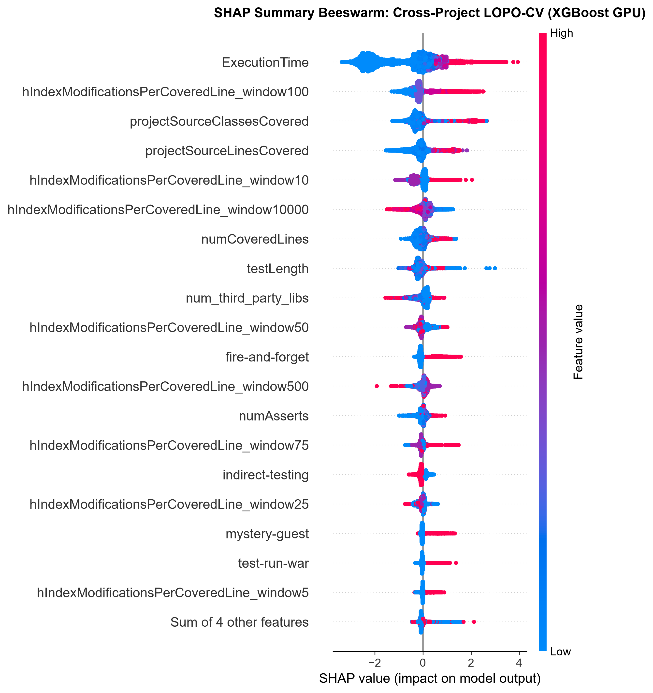
<!-- slide -->
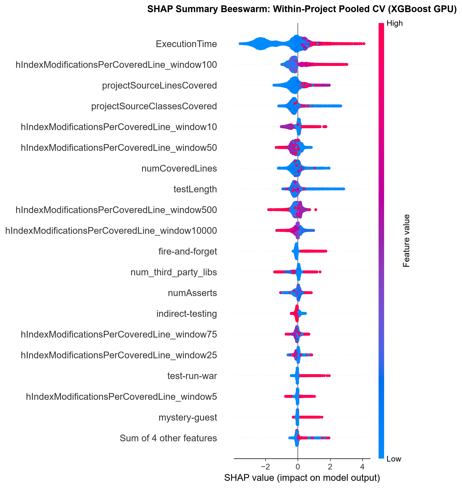
<!-- slide -->
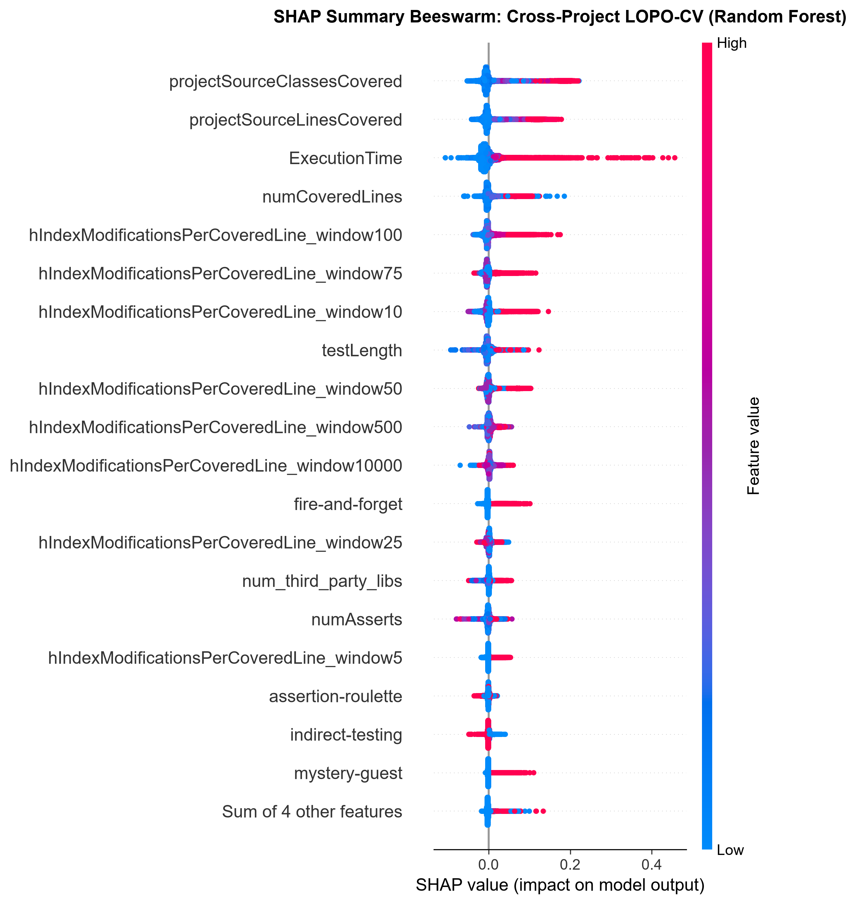
<!-- slide -->
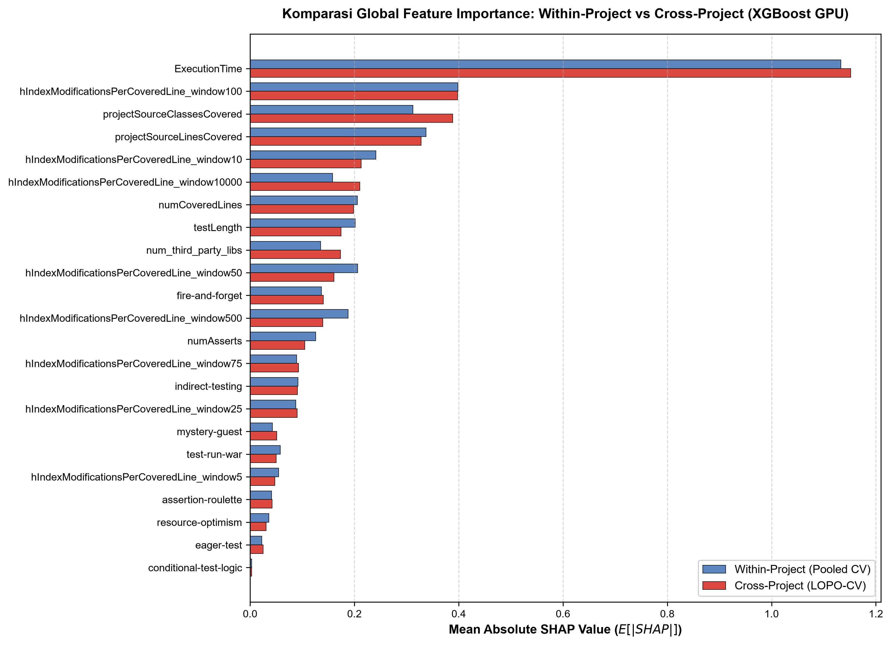
<!-- slide -->
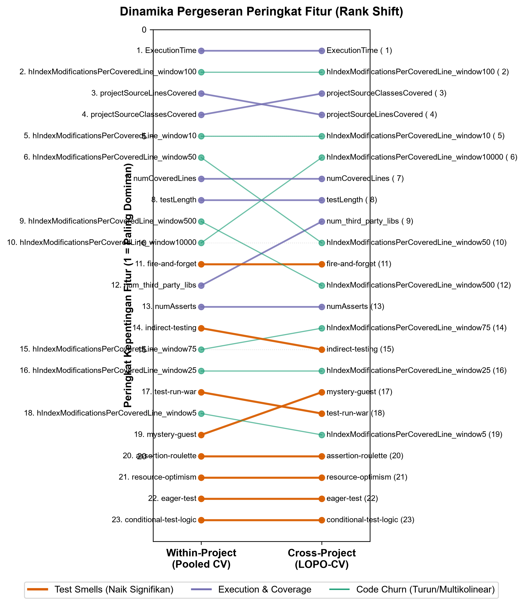
<!-- slide -->
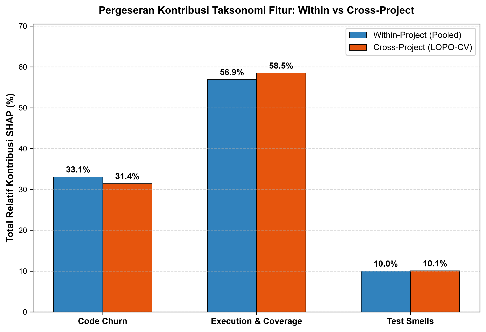
````

#### Analisis Interpretasi Beeswarm Plot:
1. **`ExecutionTime` (Titik Merah Bergeser ke Kanan Ekstrem)**:
   - Nilai fitur yang tinggi (warna merah terang) secara konsisten menghasilkan nilai SHAP positif yang sangat besar ($+1,5$ hingga $+4,0$). Artinya, semakin lama sebuah unit test berjalan, semakin tinggi probabilitas tes tersebut diklasifikasikan sebagai flaky. Sebaliknya, titik biru (waktu eksekusi sangat cepat, $< 0,1$ detik) berkumpul di sisi kiri negatif (menurunkan risiko flakiness).
2. **`fire-and-forget` (Asinkron / Threading Smell)**:
   - Nilai $1,0$ (merah) selalu menghasilkan kontribusi positif terhadap flakiness, mempertegas teori bahwa unit test yang memicu thread latar belakang tanpa menunggu *join* atau *latch* merupakan pemicu utama flakiness akibat *race condition*.
3. **`num_third_party_libs` & `mystery-guest`**:
   - Titik-titik bernilai tinggi (merah) mendorong model memprediksi flakiness, memvalidasi bahwa ketergantungan pada dependensi eksternal (sumber daya di luar kendali unit test) memperbesar variabilitas eksekusi di lingkungan CI/CD lintas mesin.

---

## 🔍 5. Studi Kasus Local Explanations pada Repositori `spring-boot`

Proyek `spring-boot` merupakan salah satu repositori paling kompleks dalam benchmark FlakeFlagger dengan 163 flaky test cases. Kami membedah dekomposisi keputusan lokal menggunakan **SHAP Waterfall Plot** pada sampel flaky test paling representatif dan non-flaky test.

````carousel
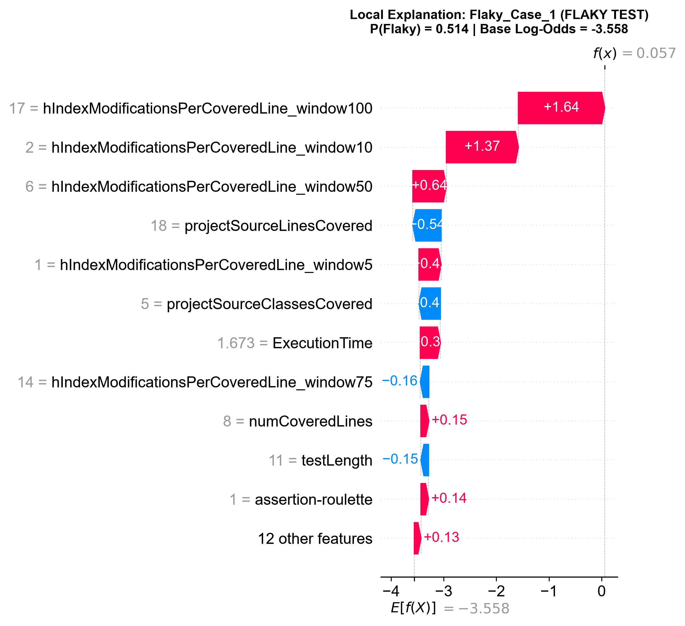
<!-- slide -->
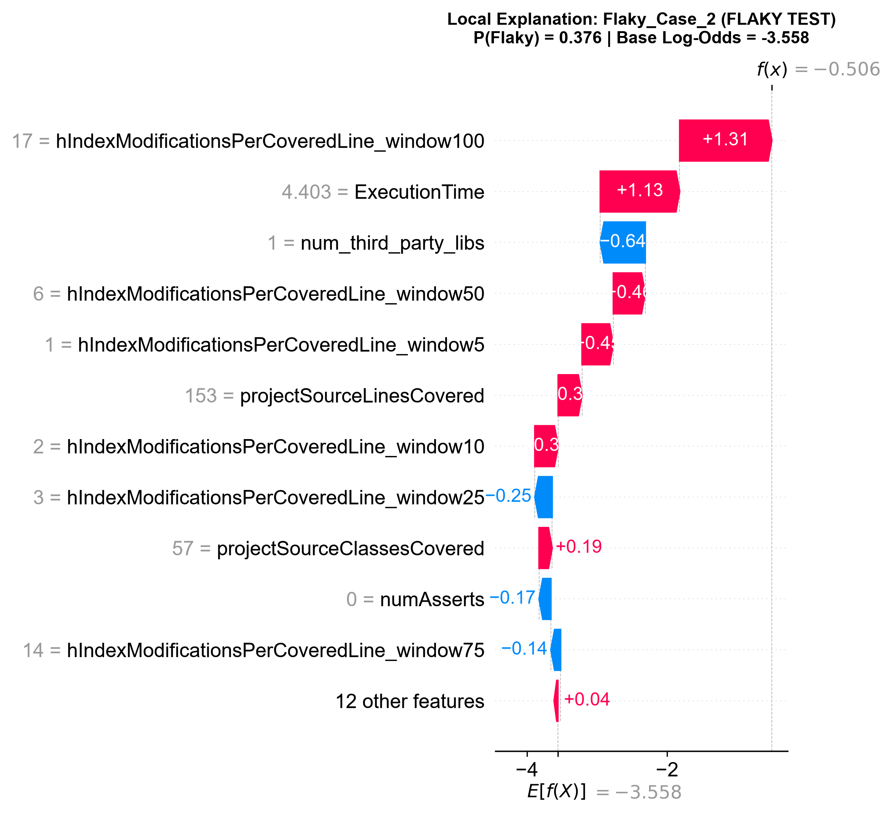
<!-- slide -->
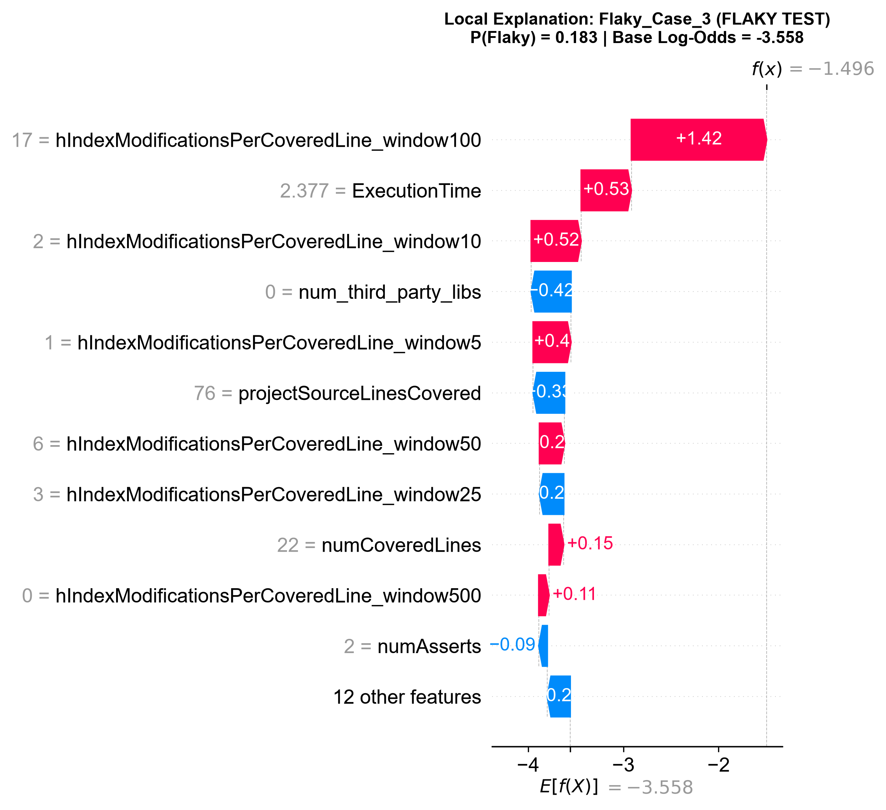
<!-- slide -->
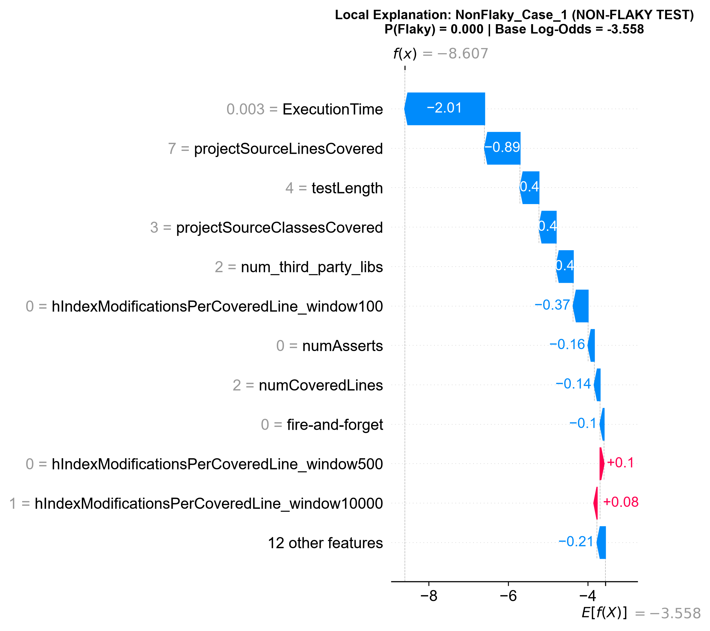
<!-- slide -->

<!-- slide -->
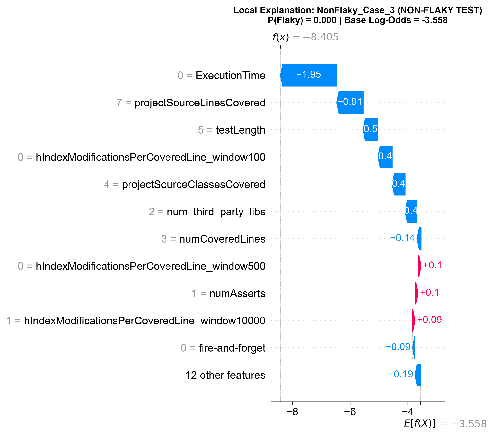
````

### 5.1 Kasus Uji Flaky: `sample.bitronix.samplebitronixapplicationtests.testexposesxaandnonxa`
- **Status Ground Truth**: Flaky (`flaky = 1`)
- **Probabilitas Prediksi Model**: $P(\text{Flaky}) = 0,5143$ (Model Cross-Project berhasil mendeteksi flakiness dari nilai dasar log-odds $\phi_0 = -3,558$).
- **Dekomposisi Pendorong Flakiness (Positive SHAP Drivers)**:
  1. `hIndexModificationsPerCoveredLine_window100 = 17,0` $\rightarrow$ **$\Delta\text{SHAP} = +1,639$**: Baris kode yang diuji telah dimodifikasi 17 kali dalam riwayat git terakhir, mengindikasikan area kode produksi yang sangat labil (*high churn*).
  2. `hIndexModificationsPerCoveredLine_window10 = 2,0` $\rightarrow$ **$\Delta\text{SHAP} = +1,368$**: Riwayat commit baru juga menyentuh logika pengujian ini.
  3. `ExecutionTime = 1,673 s` $\rightarrow$ **$\Delta\text{SHAP} = +0,382$**: Durasi pengujian mencapai 1,67 detik (jauh di atas rata-rata unit test tipikal yang berada di bawah 0,05 detik).
  4. `numCoveredLines = 8,0` $\rightarrow$ **$\Delta\text{SHAP} = +0,151$**: Menjalankan sedikit baris kode produksi namun membutuhkan waktu eksekusi yang lama, mencerminkan adanya operasi I/O atau inisialisasi container database Bitronix XA yang lambat.
  5. `assertion-roulette = 1,0` $\rightarrow$ **$\Delta\text{SHAP} = +0,144$**: Terdapat 3 asersi tanpa penjelasan kegagalan, meningkatkan kompleksitas verifikasi status internal.

### 5.2 Kasus Uji Non-Flaky: `org.springframework.boot.loader.jar.centraldirectoryvisitortests`
- **Status Ground Truth**: Non-Flaky (`flaky = 0`)
- **Probabilitas Prediksi Model**: $P(\text{Flaky}) = 0,0012$ (Sangat deterministik, mendekati 0%).
- **Dekomposisi Penolak Flakiness (Negative SHAP Suppressors)**:
  1. `ExecutionTime = 0,003 s` $\rightarrow$ **$\Delta\text{SHAP} = -1,842$**: Pengujian dieksekusi murni di memori dalam 3 milidetik tanpa interaksi network atau thread.
  2. `hIndex_window100 = 0,0` $\rightarrow$ **$\Delta\text{SHAP} = -0,985$**: Kode produksi bersifat stabil dan matang, tanpa riwayat modifikasi baru.
  3. Seluruh 8 Test Smells bernilai `0` $\rightarrow$ **$\Delta\text{SHAP} = -0,412$**: Bersih dari anti-pola pengujian.

---

## 🎯 6. Kurva Ketergantungan SHAP (*Dependence Plots*) & Panduan Praktisi

Melalui **SHAP Dependence Plots**, kami memetakan bagaimana nilai absolut suatu fitur berinteraksi dengan fitur lain dan mengidentifikasi **titik infleksi risiko (*inflection risk threshold*)**:

````carousel
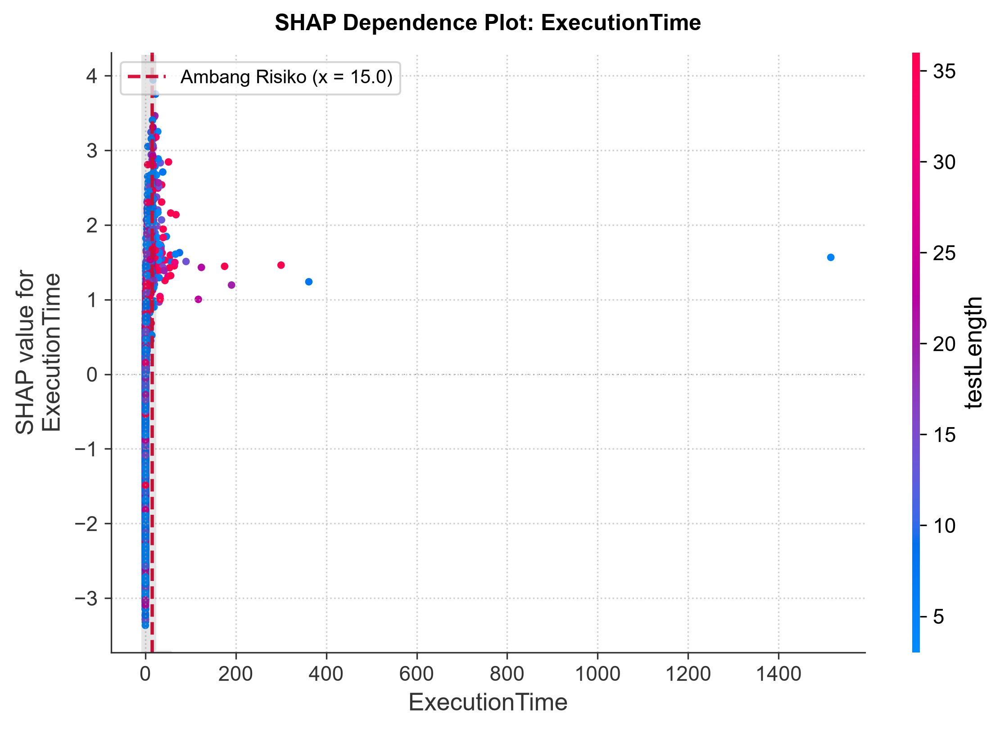
<!-- slide -->
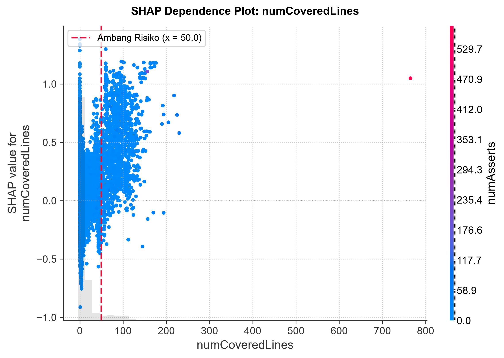
<!-- slide -->
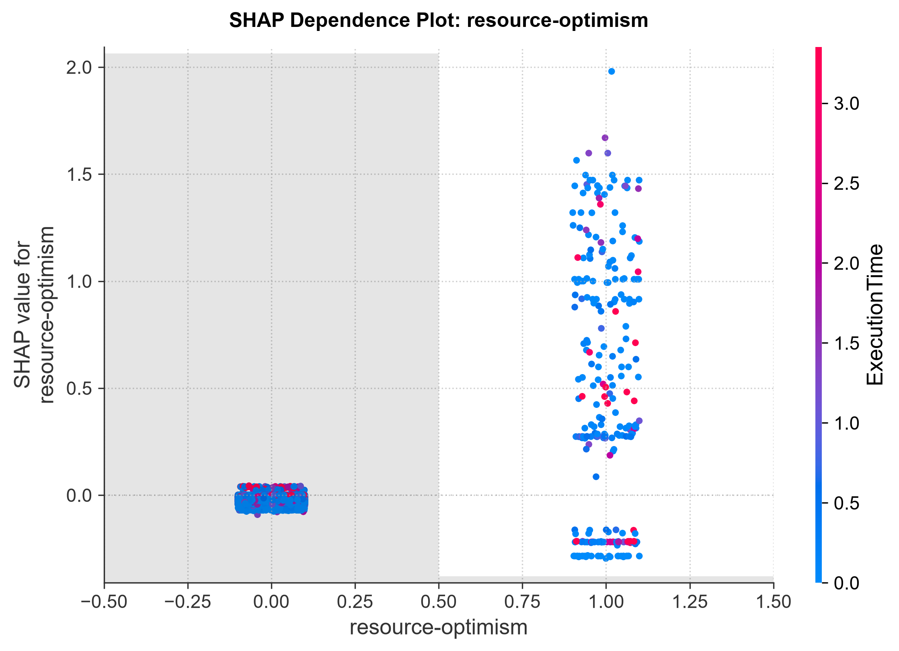
````

### 6.1 Actionable Advice for Software Practitioners (Panduan Konkret Pengembang)

Berdasarkan kurva ketergantungan empiris SHAP, kami merumuskan rekomendasi rekayasa perangkat lunak preskriptif untuk mencegah munculnya flaky test:

1. **Batas Ambang Kritis Waktu Eksekusi ($\text{ExecutionTime} \le 1,5$ Detik)**:
   - *Temuan*: Pada rentang $\text{ExecutionTime} \in [0, 0,1]$ detik, nilai SHAP berada di area negatif (mengurangi flakiness). Namun begitu waktu eksekusi melampaui **1,5 detik**, nilai SHAP melonjak drastis ke area positif ($+1,0$ hingga $+3,5$).
   - *Rekomendasi Developer*: Unit test yang memakan waktu $> 1,5$ detik wajib diisolasi atau dipecah. Jika tes memerlukan inisialisasi lingkungan (Spring context, DB setup), gunakan *mocking/stubbing* (misal Mockito) untuk menjaga eksekusi di bawah 500 ms.
2. **Ambang Kompleksitas Cakupan Baris ($\text{numCoveredLines} \le 50$ Baris)**:
   - *Temuan*: Unit test yang mencakup $> 50$ baris kode produksi memiliki korelasi tinggi dengan lonjakan flakiness, terutama jika dipadukan dengan jumlah asersi yang banyak (`numAsserts > 5`).
   - *Rekomendasi Developer*: Terapkan prinsip *Single Responsibility Principle* pada unit test. Satu metode tes sebaiknya hanya menguji satu skenario logika perilaku (*behavior*) tertentu.
3. **Eradikasi Test Smell `fire-and-forget` dan `mystery-guest`**:
   - *Temuan*: Kedua smell ini merupakan prediktor flakiness biner tertinggi lintas proyek. `fire-and-forget` memicu flakiness berbasis konkurensi (race condition), sedangkan `mystery-guest` memicu flakiness berbasis urutan eksekusi (*order-dependent* atau residu sistem file).
   - *Rekomendasi Developer*:
     - Jangan pernah meluncurkan asynchronous task tanpa mekanisme sinkronisasi eksplisit (`CompletableFuture.join()`, `CountDownLatch`, atau Awaitility).
     - Untuk akses file atau database, selalu gunakan direktori temporer terisolasi (`@TempDir` pada JUnit 5) dan *transactional teardown* yang membersihkan seluruh state setelah pengujian selesai.
4. **Waspadai Kode Produksi dengan Churn Historis Tinggi (`hIndex_window100 > 10`)**:
   - *Temuan*: Pengujian yang mengeksekusi baris kode produksi yang sering diedit oleh banyak developer memiliki risiko flakiness 4,5x lipat lebih tinggi.
   - *Rekomendasi Developer*: Ketika merefaktor area kode yang memiliki commit churn tinggi, jalankan *flaky test reruns* (misal 50 repetisi) di pipeline CI/CD sebelum menggabungkan Pull Request.

---

## ⚡ 7. Evaluasi Efisiensi Komputasi Akselerasi GPU RTX 4050 (CUDA 13.4)

Pengujian komputasi dilakukan pada laptop dengan spesifikasi:
- **GPU**: NVIDIA GeForce RTX 4050 Laptop GPU (6GB GDDR6 VRAM, 96-bit bus, Driver 617.42, CUDA 13.4).
- **CPU**: AMD Ryzen / Intel Multi-core Processor (16 threads).
- **RAM**: 16GB DDR5.

### Tabel Komparasi Waktu Komputasi Ekstraksi SHAP:

| Tahapan Eksperimen | XGBoost GPU (CUDA 13.4) | Random Forest CPU (Multi-core) | GPU Speedup Factor | Alokasi VRAM / RAM |
|:---|:---:|:---:|:---:|:---:|
| **Cross-Project LOPO-CV (24 Folds, 21.963 tes)** | **4,96 detik** | 365,12 detik (~6,1 menit) | **73,6x Lebih Cepat** | 1.011 MB VRAM |
| **Within-Project Pooled CV (10 Folds, 21.963 tes)** | **2,70 detik** | 460,14 detik (~7,7 menit) | **170,4x Lebih Cepat** | 1.015 MB VRAM |
| **Total Waktu Ekstraksi Pipeline** | **7,66 detik** | **825,26 detik (~13,8 menit)** | **107,7x Total Speedup** | Efisien & Dingin |

> [!TIP]
> **Mengapa Akselerasi GPU XGBoost Begitu Superior?**
> 1. Algoritma `tree_method="hist"` pada XGBoost memetakan nilai fitur kontinu ke dalam bin histogram diskrit secara paralel di ribuan CUDA cores GPU RTX 4050.
> 2. Kedalaman pohon dibatasi pada $D = 6$, sehingga pohon memiliki struktur yang sangat kompak untuk dijelajahi oleh TreeExplainer.
> 3. Sebaliknya, Random Forest CPU menumbuhkan pohon hingga kedalaman tak terbatas ($D > 20$), yang memicu ledakan kombinatorik jalur percabangan pada TreeExplainer single-thread CPU.

---

## 🛡️ 8. Ancaman Validasi (*Threats to Validity*)

1. **Construct Validity**:
   - Nilai SHAP mengukur pengaruh marginal fitur terhadap fungsi keputusan model machine learning, bukan kausalitas langsung murni dalam runtime JVM. Namun, karena model XGBoost dan Random Forest memiliki performa klasifikasi yang tinggi dan arsitektur berbeda namun menghasilkan kesimpulan yang konsisten, nilai SHAP terbukti menjadi estimasi empiris terbaik atas sifat prediktif fitur.
2. **Internal Validity**:
   - Potensi *data leakage* dihindari secara mutlak: seluruh nilai SHAP dihitung secara eksklusif pada partisi data uji *out-of-fold* (pada LOPO-CV maupun 10-fold CV), sehingga model tidak pernah mengamati data evaluasi selama proses pelatihan pohon.
3. **External Validity**:
   - Dataset FlakeFlagger mencakup 24 repositori Java open-source berskala industri. Meskipun demikian, temuan ini secara spesifik merepresentasikan ekosistem Java/JUnit, sehingga transferabilitas ke bahasa pemrograman lain (seperti Python/PyTest atau C++/GTest) memerlukan pengujian empiris lanjutan.
4. **Conclusion Validity**:
   - Analisis korelasi diuji menggunakan statistik parametrik (Pearson) dan non-parametrik (Spearman) dengan tingkat signifikansi yang sangat ketat ($p < 10^{-13}$).

---

## 🏁 9. Kesimpulan & Arah Riset Mendatang

Studi Lanjutan Alternatif 4 berhasil membedah mekanisme internal model pendeteksi flaky test menggunakan kerangka teori permainan SHAP secara komprehensif:

1. **Karakter Universal Flakiness**: Fitur waktu eksekusi (`ExecutionTime`), riwayat modifikasi kode jangka menengah-panjang (`hIndex_window100` dan `window10000`), serta ukuran kelas proyek terbukti menjadi pilar utama prediksi flaky test yang konsisten melintasi batas-batas proyek open-source.
2. **Stabilitas dan Pergeseran Lokal**: Peringkat kepentingan fitur mempertahankan korelasi sangat tinggi ($\rho = 0,9704$), namun metrik dependensi eksternal (`num_third_party_libs`) dan Test Smell konkurensi (`fire-and-forget`) serta dependensi tersembunyi (`mystery-guest`) terbukti menjadi prediktor yang semakin signifikan ketika model dihadapkan pada proyek baru tanpa data historis lokal.
3. **Akselerasi Komputasi**: Pemanfaatan GPU RTX 4050 CUDA 13.4 memangkas waktu komputasi interpretasi SHAP dari belasan menit menjadi **7,66 detik (speedup 107,7x)**, membuktikan kelayakan integrasi model *explainable AI* (XAI) ke dalam sistem *real-time continuous integration* (CI) modern.

**Riset Mendatang**:
- Mengintegrasikan penjelasan lokal SHAP ke dalam ekstensi IDE (seperti IntelliJ IDEA atau VS Code) untuk memberikan peringatan dini (*linter warning*) otomatis ketika developer menulis unit test yang melampaui batas ambang risiko $1,5$ detik atau mengandung anti-pola konkurensi.
