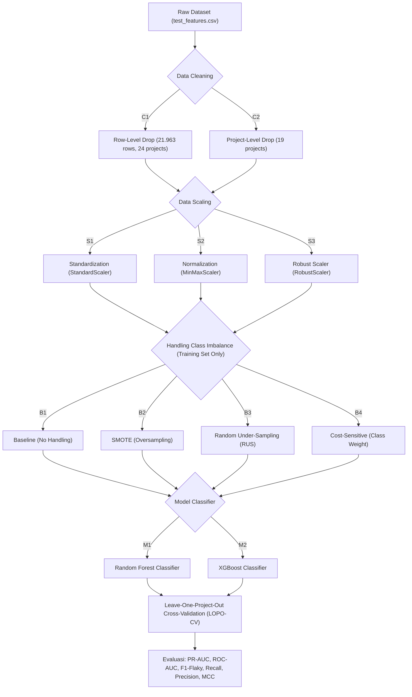

# 🔬 Rencana Penelitian: Predicting Flaky Test in Cross-Project Scenario
**Kelompok Peneliti**: Kelompok A01 — Rekayasa Perangkat Lunak A (Magister Teknik Informatika ITS)  
**Dokumen Disimpan Pada**: `Eksperimen_Bima/Rencana_Penelitian_Flaky_Test.md`  
**Acuan Paper Utama**: 
1. Alshammari et al. (ICSE 2021) — *FlakeFlagger: Predicting Flakiness Without Rerunning Tests*
2. Afeltra et al. (IEEE Access 2024) — *A Large-Scale Empirical Investigation Into Cross-Project Flaky Test Prediction*
3. Pontillo et al. (EMSE 2022) — *Static Test Flakiness Prediction: How Far Can We Go?*

---

## 📑 Daftar Isi
1. [Analisis Pemahaman & Konteks Penelitian](#1-analisis-pemahaman--konteks-penelitian)
2. [Perbandingan Paradigma: Within-Project vs Cross-Project](#2-perbandingan-paradigma-within-project-vs-cross-project)
3. [Analisis Kritis Karakteristik Dataset FlakeFlagger](#3-analisis-kritis-karakteristik-dataset-flakeflagger)
4. [Rencana Penelitian Utama (Main Research Plan)](#4-rencana-penelitian-utama-main-research-plan)
5. [Rencana Penelitian Tambahan & Alternatif (Extended Research Directions)](#5-rencana-penelitian-tambahan--alternatif-extended-research-directions)
6. [Metrik Evaluasi & Uji Signifikansi Statistik](#6-metrik-evaluasi--uji-signifikansi-statistik)
7. [Desain Arsitektur Teknis & Struktur Eksperimen](#7-desain-arsitektur-teknis--struktur-eksperimen)

---

## 1. Analisis Pemahaman & Konteks Penelitian

### 1.1 Konfirmasi & Evaluasi Pemahaman
Pemahaman yang Anda sampaikan **sangat tepat, tajam, dan relevan secara akademik**:
1. **Keterbatasan Paper Utama (FlakeFlagger)**:
   - Paper FlakeFlagger (Alshammari et al., ICSE 2021) melakukan evaluasi model dengan **Within-Project / Pooled Cross-Validation** (menggabungkan seluruh test case dari 24 proyek lalu membaginya menjadi 80/20 atau 90/10 Stratified K-Fold).
   - Akibatnya, data dari proyek yang sama tersebar di data latih (*training set*) dan data uji (*testing set*). Model dapat "melihat" sebagian test case dari proyek target saat training, sehingga berpotensi mengalami bias atau performa yang *over-optimistic* karena mempelajari karakteristik arsitektur kode dan dependensi spesifik dari proyek tersebut.
2. **Urgensi Skenario Cross-Project (Afeltra et al., 2024)**:
   - Di industri nyata, proyek baru (*newly developed software*) atau proyek yang belum memiliki riwayat eksekusi 10.000 kali rerun tidak memiliki data historis flaky test untuk melatih model lokal.
   - Pendekatan **Leave-One-Project-Out Cross-Validation (LOPO-CV)** melatih model machine learning menggunakan data dari proyek-proyek eksternal ($N-1$ proyek) dan mengujinya pada 1 proyek unseen ($1$ target project).
   - Pendekatan ini menjawab skenario realistis: *"Apakah model yang dilatih pada proyek A, B, C dapat mendeteksi flaky test pada proyek Z yang sama sekali belum pernah dilihat model?"*

---

## 2. Perbandingan Paradigma: Within-Project vs Cross-Project

| Dimensi Evaluasi | Within-Project / Pooled Validation (FlakeFlagger 2021) | Cross-Project Validation / LOPO-CV (Afeltra 2024 & Usulan Kelompok) |
|---|---|---|
| **Sumber Data Latih & Uji** | Test cases dari semua proyek digabung dalam 1 pool, diacak ke fold latih dan uji (90/10 atau 80/20). | Data latih berasal murni dari $N-1$ proyek eksternal. Data uji adalah $1$ proyek target yang diisolasi penuh. |
| **Data Leakage Risk** | **Ada risiko**: Fitur spesifik proyek (konvensi penamaan, pustaka pihak ketiga, pola penulisan assert) bocor ke test set. | **Nol risiko kebocoran proyek**: Model benar-benar diuji secara *unseen*. |
| **Kesiapan Skenario Nyata** | Hanya berlaku jika proyek sudah memiliki ratusan data flaky berlabel. | Langsung dapat diaplikasikan pada proyek baru (*zero-day prediction*). |
| **Tantangan Utama** | Ketidakseimbangan kelas (*class imbalance*). | **Domain Shift** (perbedaan distribusi metrik antar proyek) + **Class Imbalance** + Tingginya False Positive Rate. |
| **Performa Tipikal (F1)** | Relatif tinggi (~66% di FlakeFlagger). | Drop drastis jika tanpa adaptasi (~3% tanpa filtering pada Afeltra 2024, naik ke 70% dengan transfer learning). |

---

## 3. Analisis Kritis Karakteristik Dataset FlakeFlagger

Berdasarkan inspeksi langsung pada file `test_features.csv` dan `test_results.csv`:
- **Total Baris**: 22.236 test cases
- **Jumlah Proyek**: 24 repositori open-source Java
- **Distribusi Kelas**:
  - Non-Flaky: 21.425 test cases (~96,35%)
  - Flaky: 811 test cases (~3,65%) $\rightarrow$ **Sangat Imbalanced!**
- **Jumlah Fitur Prediktif**: 22 fitur (Test Smells: 8 fitur, Metrik Eksekusi & Coverage: 6 fitur, Code Churn H-Index: 8 window fitur).

### Temuan Kritis: Analisis Missing Values per Proyek
Dataset mentah memiliki total **273 missing values** pada kolom `testLength`, `numAsserts`, dan `numCoveredLines`. Sebaran missing values per proyek adalah:
1. `wildfly`: 206 baris
2. `logback`: 38 baris
3. `spring-boot`: 12 baris
4. `wro4j`: 10 baris
5. `handlebars.java`: 7 baris
*(19 proyek lainnya memiliki 0 missing values)*.

> [!WARNING]
> **Peringatan Metodologis untuk Rencana Kelompok:**
> - **Opsi Data Cleaning A (Row-Level Drop)**: Hanya menghapus 273 baris (1,23% dari total data). Seluruh 24 proyek tetap dipertahankan.
> - **Opsi Data Cleaning B (Project-Level Drop)**: Jika menghapus seluruh proyek yang memiliki missing value, maka ke-5 proyek di atas akan dibuang!
> - **Dampak Fatal Opsi B**: Proyek `spring-boot` memiliki **163 flaky tests (20% dari seluruh flaky tests di dataset)**. Membuang `spring-boot` secara project-level akan memangkas populasi flaky test secara drastis dari 811 menjadi 589 instance, yang akan melemahkan generalisasi model secara signifikan.
> - **Rekomendasi**: Hal ini menjadi hipotesis komparatif utama yang sangat bernilai untuk diuji pada RQ1 kelompok!

### Kasus Khusus Proyek `jimfs`
Proyek `jimfs` memiliki 212 test case, tetapi **0 test flaky** (100% non-flaky). Pada evaluasi LOPO-CV:
- Metrik seperti ROC-AUC atau PR-AUC tidak dapat dikalkulasi secara matematis jika kelas positif bernilai 0.
- Skema evaluasi harus mendefinisikan aturan: mengecualikan `jimfs` saat posisi test fold, atau mengevaluasinya menggunakan False Positive Rate (FPR) / Specificity.

---

## 4. Rencana Penelitian Utama (Main Research Plan)

Rencana penelitian utama dirancang secara sistematis dengan pendekatan **Full Factorial Experimental Design** berbasis matriks kombinasi pipeline yang diajukan oleh kelompok.



### 4.1 Matriks Eksperimen (Total 48 Konfigurasi Pipeline)
Matriks faktorial dibentuk dari perkalian seluruh variabel bebas:
$$\text{Total Pipelines} = 2 \text{ (Cleaning)} \times 3 \text{ (Scaling)} \times 4 \text{ (Imbalance)} \times 2 \text{ (Classifier)} = 48 \text{ Pipelines}$$

Setiap pipeline dari ke-48 konfigurasi ini akan dievaluasi melalui iterasi LOPO-CV pada setiap proyek target ($k$-fold di mana $k=24$ untuk C1, dan $k=19$ untuk C2).

### 4.2 Research Questions (RQ) Penelitian Utama

#### 🔹 RQ1 (Pengaruh Strategi Data Cleaning):
> *Bagaimana dampak penghapusan missing value pada level baris (Row-Level Drop) dibandingkan penghapusan seluruh proyek (Project-Level Drop) terhadap ketersediaan sampel flaky dan performa generalisasi model cross-project?*
- **Tujuan**: Membuktikan secara empiris apakah membuang proyek besar seperti `spring-boot` merusak kemampuan transfer knowledge model ke proyek lain.

#### 🔹 RQ2 (Pengaruh Strategi Data Scaling):
> *Teknik scaling manakah di antara Standardization, Normalization, dan Robust Scaler yang paling efektif memitigasi domain shift akibat rentang metrik yang heterogen antar proyek?*
- **Tujuan**: Mengetahui ketahanan model terhadap outlier metrik kode (misalnya baris kode atau waktu eksekusi yang sangat ekstrem pada proyek besar vs kecil). Hipotesis: `RobustScaler` unggul karena menggunakan median dan IQR.

#### 🔹 RQ3 (Pengaruh Penanganan Ketimpangan Kelas):
> *Di antara Baseline (tanpa penanganan), SMOTE, Random Under-Sampling (RUS), dan Class Weight, teknik manakah yang menghasilkan keseimbangan Precision-Recall dan F1-Score tertinggi pada proyek target?*
- **Tujuan**: Memverifikasi temuan Afeltra et al. (2024) yang menyatakan bahwa RUS lebih unggul dari SMOTE pada skenario cross-project karena SMOTE menciptakan instance sintetis di ruang fitur sumber yang berpotensi tidak realistis bagi domain target.

#### 🔹 RQ4 (Komparasi Algoritma Klasifikasi):
> *Apakah XGBoost mampu mengungguli Random Forest dalam skenario Leave-One-Project-Out cross-validation pada metrik PR-AUC dan F1-Score?*
- **Tujuan**: FlakeFlagger (2021) dan Afeltra (2024) sama-sama menobatkan Random Forest sebagai model terbaik. Pengujian XGBoost dengan regularisasi modern menjadi kontribusi komparatif signifikan.

---

## 5. Rencana Penelitian Tambahan & Alternatif (Extended Research Directions)

Untuk memberikan kebaruan (*novelty*) lebih tinggi dan memperkuat bobot tesis/makalah ilmiah kelompok di tingkat Magister, berikut adalah 4 usulan penelitian alternatif yang dapat dijadikan studi lanjutan (*extended study*):

### 🌟 Alternatif 1: Instance-Based Filtering & Transfer Learning (Menjawab Tantangan Afeltra 2024)
- **Latar Belakang**: Afeltra et al. (2024) menemukan bahwa performa cross-project standar sangat rendah ($F1 \approx 0.03$) karena perbedaan distribusi fitur (*distribution mismatch*). Namun, dengan algoritma **TrAdaBoost** atau **Burak Filter**, F1 meningkat drastis hingga **70%**.
- **Usulan Eksperimen**:
  1. **Burak Filter ($k$-NN Instance Selection)**: Untuk proyek target, pilih hanya 10% instance training dari proyek sumber yang memiliki jarak Euclidean terdekat dengan karakteristik proyek target ($k=10$).
  2. **TrAdaBoost (Transfer AdaBoost)**: Menurunkan bobot contoh uji dari proyek lain yang perilakunya bertolak belakang dengan pola proyek target secara iteratif.
- **Nilai Kontribusi**: Mengangkat makalah kelompok setara dengan publikasi bereputasi Q1/IEEE Access.

### 🌟 Alternatif 2: Validation-Based Dynamic Threshold Tuning vs Default 0.5
- **Latar Belakang**: Sebagian besar peneliti menggunakan threshold default $0.5$ untuk klasifikasi probabilitas. Pada data dengan proporsi flaky hanya 3,65%, threshold 0.5 sering kali menghasilkan nilai Precision atau Recall = 0.
- **Usulan Eksperimen**:
  - Terapkan **Inner Validation Split (80/20)** di dalam training set ($N-1$ proyek) untuk mencari *Optimal Probability Threshold* (misalnya threshold yang memaksimalkan F1 atau menjamin Recall $\ge 70\%$).
  - Terapkan threshold yang didapat tersebut pada proyek target yang diuji.
- **Nilai Kontribusi**: Menghindarkan model dari prediksi konstan kelas mayoritas tanpa terjadi kebocoran data (*zero test-leakage*).

### 🌟 Alternatif 3: Project-Agnostic Feature Engineering & Normalisasi Relatif
- **Latar Belakang**: Metrik absolut seperti `testLength` (panjang kode) atau `projectSourceLinesCovered` sangat bias terhadap ukuran proyek (proyek raksasa vs proyek micro-library).
- **Usulan Eksperimen**:
  1. Transformasi Fitur Rasio:
     - $\text{assert\_density} = \frac{\text{numAsserts}}{\text{testLength} + 1}$
     - $\text{coverage\_ratio} = \frac{\text{numCoveredLines}}{\text{testLength} + 1}$
     - $\text{class\_coverage\_ratio} = \frac{\text{projectSourceClassesCovered}}{\text{num\_third\_party\_libs} + 1}$
  2. Log Transformasi ($\log(1+x)$) untuk fitur long-tailed skewness.
  3. Reduksi Dimensi PCA khusus untuk 8 window `hIndex` churn kode yang sangat multikolinear.
- **Nilai Kontribusi**: Membangun representasi fitur yang invarian terhadap skala proyek.

### 🌟 Alternatif 4: Interpretasi Fitur Universal Menggunakan SHAP (SHapley Additive exPlanations)
- **Latar Belakang**: Pengembang software tidak hanya ingin tahu *apakah* suatu test diprediksi flaky, tetapi *mengapa* model menganggap test tersebut flaky.
- **Usulan Eksperimen**:
  - Menggunakan SHAP TreeExplainer untuk menganalisis fitur dominan pada Random Forest dan XGBoost.
  - Membandingkan: Apakah prediktor flaky di skenario cross-project sama dengan within-project (misal: apakah `ExecutionTime` dan `numCoveredLines` tetap menjadi fitur paling dominan, ataukah *Test Smells* seperti `fire-and-forget` menjadi lebih relevan lintas proyek)?

---

## 6. Metrik Evaluasi & Uji Signifikansi Statistik

### 6.1 Metrik Evaluasi yang Wajib Digunakan
Karena ketimpangan kelas yang ekstrem (3,65% flaky), metrik **Accuracy konvensional TIDAK BOLEH digunakan sebagai acuan utama** (prediktor naif yang selalu menebak non-flaky akan mendapat akurasi 96,35% namun tidak berguna sama sekali).

Metrik yang wajib dilaporkan:
1. **PR-AUC (Precision-Recall Area Under Curve / Average Precision)**: Metrik paling representatif untuk evaluasi imbalanced data.
2. **F1-Score (Khusus Kelas Flaky / Minoritas)**: Harmonik rata-rata dari Precision dan Recall flaky.
3. **Recall (Flaky)**: Persentase flaky test yang berhasil ditemukan (menghindari false negatives).
4. **Precision (Flaky)**: Tingkat akurasi peringatan flaky (menghindari pemborosan waktu developer akibat false alarms).
5. **ROC-AUC**: Kemampuan diskriminasi umum model.
6. **MCC (Matthews Correlation Coefficient)**: Koefisien korelasi biner yang seimbang untuk dataset tidak seimbang.

### 6.2 Uji Signifikansi Statistik
Mengikuti standar empiris *ACM/SIGSOFT Empirical Standards*:
- **Friedman Test**: Untuk menguji apakah ada perbedaan signifikan secara statistik di antara berbagai konfigurasi pipeline pada seluruh lipatan proyek target.
- **Nemenyi Post-hoc Test**: Untuk membuat peringkat (*ranking*) dan visualisasi diagram *Critical Difference (CD)* dari ke-48 pipeline.

---

## 7. Desain Arsitektur Teknis & Struktur Eksperimen

Seluruh eksperimen, script otomasi, notebook, dan hasil logging akan diisolasi secara ketat di dalam folder `Eksperimen_Bima/` tanpa mengubah kode atau data di folder lain.

### Struktur Direktori yang Direncanakan:
```
Eksperimen_Bima/
├── README.md                                 # Ringkasan singkat repositori eksperimen
├── Rencana_Penelitian_Flaky_Test.md         # Dokumen master rencana penelitian lengkap (file ini)
├── configs/
│   └── experiment_matrix.json                # Definisi parameter 48 pipeline eksperimen
├── src/
│   ├── __init__.py
│   ├── data_loader.py                        # Modul pembacaan data & penerapan cleaning (C1 & C2)
│   ├── scalers.py                            # Modul scaling (Standard, MinMax, Robust)
│   ├── balancers.py                          # Modul imbalance (None, SMOTE, RUS, ClassWeight)
│   ├── models.py                             # Inisialisasi RF & XGBoost
│   ├── lopo_evaluator.py                     # Mesin eksekusi Leave-One-Project-Out CV
│   └── metrics_calculator.py                 # Perhitungan PR-AUC, F1, MCC, dll.
├── notebooks/
│   ├── 01_benchmark_main_pipelines.ipynb     # Notebook eksekusi 48 pipeline utama
│   └── 02_extended_transfer_learning.ipynb   # Notebook studi alternatif (TrAdaBoost / Threshold)
└── results/
    ├── raw_predictions/                      # Log prediksi baris per baris per fold
    ├── summary_metrics_48_pipelines.csv      # Rekapitulasi rata-rata metrik semua konfigurasi
    └── plots/                                # Boxplot, heatmap, dan CD diagrams
```

---
*Dokumen ini disusun sebagai panduan strategis dan operasional riset kelompok A01.*
