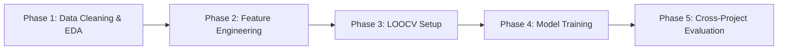

# 🧪 Predicting Flaky Test in Cross-Project Scenario

> **Penelitian Eksperimen**: Memprediksi *Flaky Test* menggunakan pendekatan Machine Learning secara *Project-Agnostic* pada skenario lintas proyek (*Cross-Project Scenario*).
> 
> Dataset berasal dari riset **FlakeFlagger**: *Predicting Flakiness Without Rerunning Tests* (Alshammari et al., ICSE 2021).

---

## 📌 1. Ikhtisar Penelitian

*Flaky test* adalah test case yang menunjukkan hasil yang tidak konsisten (kadang lolos, kadang gagal) pada versi kode yang sama tanpa ada perubahan. Deteksi flaky test tradisional membutuhkan eksekusi berulang (*rerunning*) hingga ribuan kali yang memakan waktu dan sumber daya tinggi.

Penelitian ini bertujuan untuk:
1. **Prediksi Tanpa Rerun**: Memprediksi flakiness berdasarkan atribut static & dynamic test (Test Smells, Test Metrics, Coverage, Code Churn, Dependency) tanpa melakukan rerun.
2. **Skenario Cross-Project (Project-Agnostic)**: Melatih model pada sekumpulan proyek dan mengujinya pada proyek baru yang belum pernah dilihat (*unseen project*), dengan mengeklusi fitur-fitur spesifik identitas proyek.

---

## 📁 2. Deskripsi Struktur Direktori

Berikut adalah struktur direktori proyek beserta fungsi dari masing-masing folder dan filenya:

```
Experiment_Ali/
├── 📁 data/                 # Folder berisi dataset mentah & hasil pemrosesan
│   ├── test_features.csv            # Dataset mentah (22.236 baris, 29 kolom: 22 fitur prediktif)
│   ├── test_results.csv             # Detail statistik rerun 10.000x per test case (22.245 baris)
│   ├── cleaned_test_features.csv    # Dataset hasil pembersihan & imputasi (Phase 1, 29 kolom)
│   ├── engineered_test_features.csv # Dataset hasil feature engineering (Phase 2, 58 kolom)
│   └── README.md                    # Dokumentasi lengkap skema & penjelasan fitur dataset
│
├── 📁 notebook/             # Folder berisi Jupyter Notebooks & dokumen analisa
│   ├── 01_eda_and_feature_inspection.ipynb  # Phase 1: Cleaning, Imputasi & EDA per Proyek
│   ├── 02_feature_engineering_scaling.ipynb # Phase 2: Fitur Rasio, Log Transform, Scaling & PCA
│   └── todo_analyze.md              # Dokumen analisa posibilitas & roadmap 5-phase eksperimen
│
├── 📁 script/               # Folder berisi script Python pembantu & otomatisasi
│   ├── build_full_notebook.py       # Script untuk membuat & mengompilasi Notebook Phase 1
│   ├── build_phase2_notebook.py     # Script untuk membuat & mengompilasi Notebook Phase 2
│   └── generate_notebook.py         # Script pembantu template notebook
│
└── 📄 README.md             # Dokumen utama ini (Rekapitulasi proyek & struktur)
```

---

## 📑 3. Detail Setiap Direktori

### 3.1 📂 `data/`
Folder ini merupakan repositori data eksperimen.
- **`test_features.csv`**: File dataset mentah yang diekstraksi oleh FlakeFlagger, berisi 22.236 test case dari 24 proyek Java open-source (29 kolom, 22 fitur prediktif).
- **`test_results.csv`**: File log hasil eksekusi 10.000 kali rerun untuk setiap test case (22.245 baris), mencatat jumlah gagal, lolos, dan tipe exception.
- **`cleaned_test_features.csv`**: Dataset hasil **Phase 1** di mana missing values (273 baris) pada `testLength`, `numAsserts`, dan `numCoveredLines` telah diimputasi menggunakan *Group-Aware Median & Probabilistic Imputation* (22.236 baris, 29 kolom, 0 missing).
- **`engineered_test_features.csv`**: Dataset hasil **Phase 2** yang berisi 29 kolom asal + 29 kolom turunan (fitur rasio, `log1p` transform, versi `StandardScaler`/`RobustScaler`, dan 3 komponen PCA `hIndex`) → total **58 kolom**.
- **`README.md`**: Panduan komprehensif mengenai definisi 22 fitur (Test Smell, Metrics, Coverage, H-Index Churn, dan Dependency) serta hubungan antar fitur.

### 3.2 📂 `notebook/`
Folder ini berisi lembar kerja interaktif untuk eksplorasi data, pemodelan, dan evaluasi.
- **`01_eda_and_feature_inspection.ipynb`**: Notebook eksekusi Phase 1 yang mencakup pemisahan matriks fitur $X$ dan metadata, imputasi missing values, analisis ketimpangan kelas target per proyek, inspeksi *domain shift* (skala fitur), dan korelasi antar fitur.
- **`02_feature_engineering_scaling.ipynb`**: Notebook eksekusi Phase 2 yang mencakup pembuatan fitur rasio *project-agnostic*, log transformation fitur skewed, perbandingan `StandardScaler` vs `RobustScaler`, reduksi multikolinearitas 8 window `hIndex` via PCA, serta ekspor `data/engineered_test_features.csv`.
- **`todo_analyze.md`**: Dokumen analisis kelayakan (*feasibility study*) rencana *project-agnostic prediction*, tantangan utama (domain shift, class imbalance, multikolinearitas), serta strategi penanganannya.

### 3.3 📂 `script/`
Folder ini menyimpan kode Python modular untuk mengotomatisasi pemrosesan data dan pembuatan notebook secara sistematis.
- **`build_full_notebook.py`**: Membangun dan mengkompilasi notebook `01_eda_and_feature_inspection.ipynb` secara terstruktur dengan visualisasi dan output yang terisi.
- **`build_phase2_notebook.py`**: Membangun dan mengkompilasi notebook `02_feature_engineering_scaling.ipynb` (Phase 2) beserta output dataset engineered.
- **`generate_notebook.py`**: Script pembantu berisi template mentah notebook Phase 1 (versi tanpa output terisi).

---

## 🚀 4. Roadmap Eksperimen (5-Phase Roadmap)

Penelitian ini dijalankan secara bertahap mengikuti 5 fase utama:



1. ✅ **Phase 1: Data Preparation, Imputation & Inspection** *(Selesai)*
   - Pemisahan metadata vs matriks fitur $X$.
   - Imputasi *group-aware probabilistic/median* pada 273 missing values.
   - Analisis deskriptif skala & distribusi flaky test per proyek.
2. ✅ **Phase 2: Feature Engineering & Normalization** *(Selesai)*
   - Pembuatan fitur rasio ($\text{coverage\_ratio}$, $\text{assert\_density}$, $\text{class\_coverage\_ratio}$).
   - Log transformation ($\log(x+1)$) untuk fitur berdistribusi skewed.
   - Normalisasi `StandardScaler` dan `RobustScaler` untuk mitigasi *domain shift*.
   - Kompresi PCA pada 8 window `hIndex` untuk eliminasi multikolinearitas.
3. ⏳ **Phase 3: Validation Strategy Setup (Leave-One-Project-Out / LOOCV)** *(Berikutnya)*
   - Menyusun skema LOOCV (24-fold): Latih pada 23 proyek, uji pada 1 proyek unseen.
4. ⏳ **Phase 4: Model Training & Handling Class Imbalance**
   - Pemodelan dengan XGBoost, LightGBM, Random Forest, dan CatBoost.
   - Penanganan class imbalance via `scale_pos_weight`, `class_weight='balanced'`, dan threshold tuning.
5. ⏳ **Phase 5: Evaluation & Interpretability**
   - Evaluasi berbasis PR-AUC, F1-Score, dan Recall.
   - Analisis kontribusi fitur universal menggunakan **SHAP (SHapley Additive exPlanations)**.

---

## 🛠️ 5. Cara Menjalankan Project

### Prasyarat
Python 3.10+ dengan library:
```bash
pip install pandas numpy matplotlib seaborn scikit-learn
```

### Menjalankan Phase 1 (EDA & Data Cleaning)
Untuk membangun ulang dataset bersih dan notebook Phase 1:
```bash
python3 script/build_full_notebook.py
```
Hasil dataset bersih akan tersimpan secara otomatis di `data/cleaned_test_features.csv`.

### Menjalankan Phase 2 (Feature Engineering & Scaling)
Pastikan `data/cleaned_test_features.csv` sudah ada (hasil Phase 1), lalu:
```bash
python3 script/build_phase2_notebook.py
```
Hasil dataset engineered akan tersimpan secara otomatis di `data/engineered_test_features.csv`.
