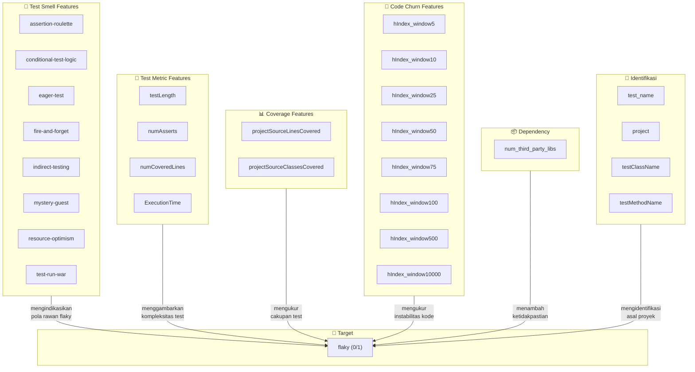
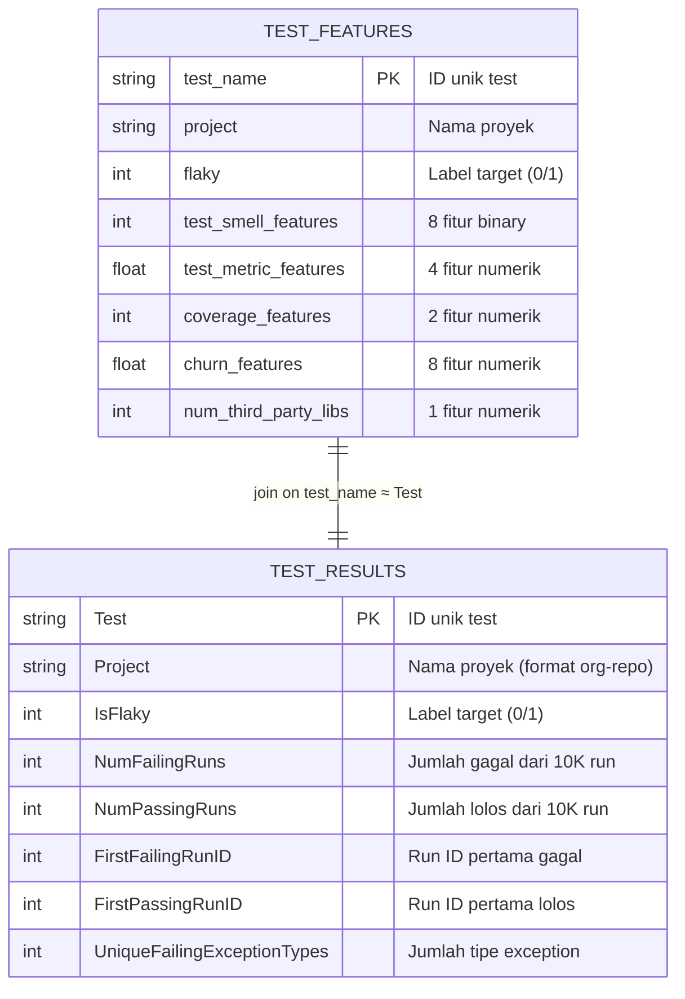

# 📁 Data — FlakeFlagger Dataset

> Dataset yang digunakan dalam penelitian **"Predicting Flaky Test in Cross-Project Scenario"**.
> Sumber dataset: [FlakeFlagger: Predicting Flakiness Without Rerunning Tests](https://github.com/nicholasalx/FlakeFlagger) (Alshammari et al., ICSE 2021).

---

## 1. Ringkasan Dataset

Dataset ini dikumpulkan dengan menjalankan ulang (*rerun*) test suite dari **24 proyek open-source Java** masing-masing sebanyak **10.000 kali** untuk membangun *ground truth* flaky test.

| Metrik | Nilai |
|---|---|
| Total test case (features) | 22.235 |
| Total test case (results) | 22.244 |
| Flaky test | 811 (≈ 3,65%) |
| Non-flaky test | 21.425 (≈ 96,35%) |
| Jumlah proyek | 24 |
| Jumlah fitur prediktif | 22 |

> [!IMPORTANT]
> Dataset ini sangat **imbalanced** — hanya ~3,65% test yang flaky. Teknik penanganan *class imbalance* (oversampling, undersampling, cost-sensitive learning, dll.) perlu dipertimbangkan saat pelatihan model.

---

## 2. Deskripsi File

### 2.1 `test_features.csv`

File utama berisi **fitur-fitur prediktif** yang diekstraksi dari setiap test case. Digunakan sebagai input untuk melatih model machine learning.

- **Baris**: 22.236 (1 header + 22.235 data)
- **Kolom**: 29

### 2.2 `test_results.csv`

File berisi **hasil rerun** dari setiap test case, mencatat berapa kali test gagal/lolos dari 10.000 kali eksekusi.

- **Baris**: 22.245 (1 header + 22.244 data)
- **Kolom**: 8

---

## 3. Skema Kolom — `test_features.csv`

### 3.1 Kolom Identifikasi

| # | Kolom | Tipe | Deskripsi |
|---|---|---|---|
| 1 | `Unnamed: 0` | `int` | Index baris (dari proses ekspor pandas) |
| 2 | `test_name` | `str` | Nama unik test case (fully qualified: `package.class.method`) |
| 3 | `project` | `str` | Nama proyek asal test case |
| 4 | `testClassName` | `str` | Nama kelas test (fully qualified class name) |
| 5 | `testMethodName` | `str` | Nama method test |

### 3.2 Kolom Target (Label)

| # | Kolom | Tipe | Deskripsi |
|---|---|---|---|
| 6 | `flaky` | `binary (0/1)` | **Label target** — `1` = flaky, `0` = non-flaky |

### 3.3 Fitur Test Smell (Binary)

Test smell adalah pola desain buruk (*anti-pattern*) dalam penulisan test. Setiap fitur bernilai `0` (tidak ada) atau `1` (terdeteksi).

| # | Kolom | Deskripsi |
|---|---|---|
| 7 | `assertion-roulette` | Test memiliki **banyak assertion tanpa pesan penjelasan**, sehingga sulit menentukan assertion mana yang gagal |
| 8 | `conditional-test-logic` | Test mengandung **logika kondisional** (`if`, `switch`, `for`, `while`) yang membuat alur eksekusi tidak deterministik |
| 9 | `eager-test` | Test menguji **terlalu banyak method** dari production code sekaligus |
| 10 | `fire-and-forget` | Test memulai **thread/async operation tanpa menunggu hasilnya**, berpotensi race condition |
| 11 | `indirect-testing` | Test menguji fungsionalitas secara **tidak langsung** melalui dependency/kolaborator |
| 12 | `mystery-guest` | Test bergantung pada **sumber daya eksternal** (file, database, network) yang tidak dikontrol |
| 13 | `resource-optimism` | Test **mengasumsikan ketersediaan resource** (file, koneksi) tanpa pengecekan keberadaannya |
| 14 | `test-run-war` | Test **berkonflik dengan test lain** saat dijalankan paralel (shared state/resource) |

### 3.4 Fitur Test Metric (Numerik)

| # | Kolom | Tipe | Deskripsi |
|---|---|---|---|
| 15 | `testLength` | `int` | Jumlah **baris kode** (LOC) dari method test |
| 16 | `numAsserts` | `int` | Jumlah **statement assertion** dalam test |
| 17 | `numCoveredLines` | `int` | Jumlah **baris production code** yang di-cover oleh test |
| 18 | `ExecutionTime` | `float` | **Waktu eksekusi** test (dalam detik) |

### 3.5 Fitur Coverage (Numerik)

| # | Kolom | Tipe | Deskripsi |
|---|---|---|---|
| 19 | `projectSourceLinesCovered` | `int` | Total **baris source code proyek** yang di-cover oleh test |
| 20 | `projectSourceClassesCovered` | `int` | Total **kelas source code proyek** yang di-cover oleh test |

### 3.6 Fitur Code Churn / H-Index (Numerik)

Fitur berbasis **H-Index** yang mengukur seberapa sering baris kode yang di-cover oleh test mengalami modifikasi (*code churn*) dalam jendela waktu (*window*) tertentu berdasarkan riwayat commit git.

> **Definisi**: *h-index of modifications per covered line* — Jika test meng-cover *n* baris, dan baris-baris tersebut dimodifikasi *k₁, k₂, ..., kₙ* kali, maka h-index-nya adalah nilai *h* terbesar sehingga ada *h* baris yang masing-masing dimodifikasi minimal *h* kali.

| # | Kolom | Window (commit terakhir) | Deskripsi |
|---|---|---|---|
| 21 | `hIndexModificationsPerCoveredLine_window5` | 5 | H-index modifikasi dalam 5 commit terakhir |
| 22 | `hIndexModificationsPerCoveredLine_window10` | 10 | H-index modifikasi dalam 10 commit terakhir |
| 23 | `hIndexModificationsPerCoveredLine_window25` | 25 | H-index modifikasi dalam 25 commit terakhir |
| 24 | `hIndexModificationsPerCoveredLine_window50` | 50 | H-index modifikasi dalam 50 commit terakhir |
| 25 | `hIndexModificationsPerCoveredLine_window75` | 75 | H-index modifikasi dalam 75 commit terakhir |
| 26 | `hIndexModificationsPerCoveredLine_window100` | 100 | H-index modifikasi dalam 100 commit terakhir |
| 27 | `hIndexModificationsPerCoveredLine_window500` | 500 | H-index modifikasi dalam 500 commit terakhir |
| 28 | `hIndexModificationsPerCoveredLine_window10000` | 10.000 | H-index modifikasi dalam 10.000 commit terakhir |

### 3.7 Fitur Dependency

| # | Kolom | Tipe | Deskripsi |
|---|---|---|---|
| 29 | `num_third_party_libs` | `int` | Jumlah **library pihak ketiga** yang digunakan oleh test |

---

## 4. Skema Kolom — `test_results.csv`

| # | Kolom | Tipe | Deskripsi |
|---|---|---|---|
| 1 | `Project` | `str` | Nama proyek (format `org-repo`) |
| 2 | `Test` | `str` | Nama test case (fully qualified `class#method`) |
| 3 | `IsFlaky` | `binary (0/1)` | Label flaky: `1` = flaky, `0` = non-flaky |
| 4 | `NumFailingRuns` | `int` | Jumlah run yang **gagal** (dari 10.000 run) |
| 5 | `NumPassingRuns` | `int` | Jumlah run yang **lolos** (dari 10.000 run) |
| 6 | `FirstFailingRunID` | `int` | ID run pertama kali test gagal (`-1` jika tidak pernah gagal) |
| 7 | `FirstPassingRunID` | `int` | ID run pertama kali test lolos (`-1` jika tidak pernah lolos) |
| 8 | `UniqueFailingExceptionTypes` | `int` | Jumlah **tipe exception unik** yang muncul saat test gagal |

---

## 5. Distribusi Data per Proyek

| Proyek | Total Test | Flaky | Non-Flaky | % Flaky |
|---|---:|---:|---:|---:|
| achilles | 1.317 | 4 | 1.313 | 0,30% |
| activiti | 2.044 | 32 | 2.012 | 1,57% |
| alluxio | 187 | 116 | 71 | **62,03%** |
| ambari | 324 | 52 | 272 | 16,05% |
| assertj-core | 6.261 | 1 | 6.260 | 0,02% |
| commons-exec | 55 | 1 | 54 | 1,82% |
| elastic-job-lite | 558 | 3 | 555 | 0,54% |
| handlebars.java | 427 | 1 | 426 | 0,23% |
| hbase | 431 | 145 | 286 | **33,64%** |
| hector | 142 | 33 | 109 | **23,24%** |
| http-request | 163 | 18 | 145 | 11,04% |
| httpcore | 712 | 22 | 690 | 3,09% |
| incubator-dubbo | 2.176 | 19 | 2.157 | 0,87% |
| java-websocket | 145 | 23 | 122 | 15,86% |
| jimfs | 212 | 0 | 212 | 0,00% |
| logback | 843 | 22 | 821 | 2,61% |
| ninja | 307 | 1 | 306 | 0,33% |
| okhttp | 810 | 100 | 710 | **12,35%** |
| orbit | 86 | 7 | 79 | 8,14% |
| spring-boot | 2.127 | 163 | 1.964 | **7,66%** |
| undertow | 183 | 7 | 176 | 3,83% |
| wildfly | 1.236 | 23 | 1.213 | 1,86% |
| wro4j | 1.145 | 16 | 1.129 | 1,40% |
| zxing | 345 | 2 | 343 | 0,58% |

> [!NOTE]
> Distribusi flaky test sangat bervariasi antar proyek — dari 0% (jimfs) hingga 62% (alluxio). Variasi ini menjadi tantangan utama dalam skenario **cross-project prediction**.

---

## 6. Hubungan Antar Fitur

### 6.1 Diagram Hubungan Kategori Fitur

### 6.2 Hubungan Intra-Kategori

#### Test Smell ↔ Test Metric

| Hubungan | Penjelasan |
|---|---|
| `testLength` ↔ `assertion-roulette` | Test yang lebih panjang cenderung memiliki lebih banyak assertion tanpa pesan, sehingga lebih rentan terhadap assertion roulette |
| `testLength` ↔ `conditional-test-logic` | Test yang lebih panjang memiliki kemungkinan lebih besar mengandung logika kondisional |
| `numAsserts` ↔ `assertion-roulette` | Semakin banyak assertion, semakin tinggi probabilitas assertion roulette terdeteksi |
| `ExecutionTime` ↔ `fire-and-forget` | Test dengan operasi async (fire-and-forget) sering memiliki waktu eksekusi yang bervariasi |
| `ExecutionTime` ↔ `mystery-guest` | Akses resource eksternal meningkatkan dan membuat tidak stabil waktu eksekusi |

#### Coverage ↔ Code Churn

| Hubungan | Penjelasan |
|---|---|
| `numCoveredLines` ↔ `hIndex_window*` | Semakin banyak baris yang di-cover, semakin besar kemungkinan beberapa di antaranya sering dimodifikasi → h-index lebih tinggi |
| `projectSourceLinesCovered` ↔ `projectSourceClassesCovered` | Kedua fitur ini **sangat berkorelasi** — lebih banyak kelas berarti lebih banyak baris yang di-cover |
| `hIndex_window5` → ... → `hIndex_window10000` | Fitur-fitur h-index bersifat **monoton non-decreasing** terhadap window — window lebih besar selalu ≥ window lebih kecil |

#### Test Smell ↔ Flakiness

| Hubungan | Penjelasan |
|---|---|
| `fire-and-forget` → `flaky` | Operasi async tanpa sinkronisasi menyebabkan **race condition** — penyebab utama flakiness |
| `mystery-guest` → `flaky` | Ketergantungan pada resource eksternal (file, network, DB) yang tidak dikontrol test menyebabkan **non-determinism** |
| `resource-optimism` → `flaky` | Asumsi bahwa resource selalu tersedia menyebabkan kegagalan intermittent |
| `test-run-war` → `flaky` | Konflik antar test yang berjalan paralel menyebabkan hasil yang tidak konsisten |

### 6.3 Fitur dengan Information Gain Tertinggi

Berdasarkan temuan paper FlakeFlagger, fitur-fitur berikut memiliki **information gain tertinggi** untuk memprediksi flakiness:

1. **`ExecutionTime`** — Waktu eksekusi test
2. **`projectSourceLinesCovered`** / **`projectSourceClassesCovered`** — Cakupan test terhadap production code
3. **`hIndexModificationsPerCoveredLine_window*`** — Code churn pada baris yang di-cover
4. **`num_third_party_libs`** — Jumlah library pihak ketiga

> [!TIP]
> Meskipun test smell secara intuitif berkaitan dengan flakiness, paper FlakeFlagger menemukan bahwa **test smell BUKAN prediktor yang efektif** dibandingkan fitur-fitur coverage dan code churn. Hal ini penting untuk dipertimbangkan dalam pemilihan fitur (*feature selection*).

---

## 7. Hubungan Antar File

- **`test_features.csv`** menyediakan **fitur-fitur untuk prediksi** (input model ML).
- **`test_results.csv`** menyediakan **detail hasil rerun** yang bisa digunakan untuk analisis lebih mendalam tentang *severity* flakiness (misal: test yang gagal 5.000 dari 10.000 kali vs. yang hanya gagal 1 kali).
- Kedua file bisa di-join berdasarkan kolom `test_name` (features) ≈ `Test` (results), dengan penyesuaian format nama.

---

## 8. Catatan untuk Cross-Project Prediction

Dalam skenario **cross-project**, model dilatih pada data dari satu atau beberapa proyek dan diuji pada proyek yang berbeda. Beberapa hal yang perlu diperhatikan:

1. **Distribusi fitur berbeda antar proyek** — Proyek besar (spring-boot, wildfly) memiliki distribusi `testLength`, `numCoveredLines`, dan `ExecutionTime` yang sangat berbeda dari proyek kecil (commons-exec, orbit).

2. **Rasio flaky bervariasi drastis** — Dari 0% (jimfs) hingga 62% (alluxio), sehingga model harus robust terhadap variasi distribusi kelas.

3. **Fitur project-agnostic lebih penting** — Fitur seperti test smell (binary) dan h-index (normalized) cenderung lebih transferable antar proyek dibandingkan fitur absolut seperti `projectSourceLinesCovered`.

4. **Kolom `project`** harus digunakan **hanya untuk splitting data** (train/test), bukan sebagai fitur prediktif, agar model benar-benar belajar pola cross-project.

---

## 9. Referensi

- Alshammari, A., Morris, C., Hilton, M., & Bell, J. (2021). **FlakeFlagger: Predicting Flakiness Without Rerunning Tests**. *Proceedings of the 43rd International Conference on Software Engineering (ICSE '21)*.
- Repository: [https://github.com/nicholasalx/FlakeFlagger](https://github.com/nicholasalx/FlakeFlagger)
