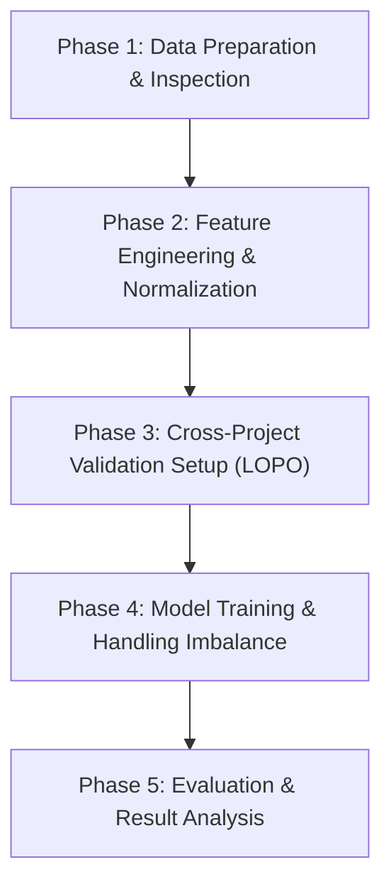

# 📊 Analisa Posibilitas & Plan Eksperimen: Predicting Flaky Test (Cross-Project Scenario)

Dokumen ini berisi analisis kelayakan (*feasibility analysis*) dan panduan langkah kerja (*step-by-step roadmap*) untuk penelitian prediksi flaky test menggunakan skenario **Cross-Project Prediction** secara **Project-Agnostic**.

---

## 1. Analisa Posibilitas Rencana (Feasibility Analysis)

### 1.1 Gambaran Umum Rencana
Rencana Anda adalah menghapus seluruh fitur identitas proyek dan test (`project`, `test_name`, `testClassName`, `testMethodName`, `Unnamed: 0`) dan hanya menyisakan **22 fitur independen** yang terbagi menjadi:
1. **Test Smell** (8 fitur binary)
2. **Test Metrics** (4 fitur numerik)
3. **Coverage Features** (2 fitur numerik)
4. **Code Churn Features** (8 fitur numerik H-Index)
5. **Dependency** (1 fitur numerik)

---

### 1.2 Analisis Kekuatan & Peluang (Strengths & Opportunities)

> [!TIP]
> **Keputusan Sangat Tepat**: Menghapus fitur identifikasi adalah **syarat mutlak** dalam riset *cross-project defect/flaky prediction* untuk menghindari *data leakage* dan mencegah model mengalami *memorization* (hanya menghafal nama kelas/proyek tertentu).

1. **True Generalizability**: Dengan hanya melatih model pada fitur perilaku/karakteristik teknis, model dipaksa mempelajari pola universal mengapa suatu test menjadi flaky (misal: eksekusi lama + churn tinggi + ada `mystery-guest`).
2. **Skematisasi LOPO (Leave-One-Project-Out)**: Dataset yang terdiri dari 24 proyek sangat ideal untuk diuji menggunakan evaluasi *Leave-One-Project-Out CV*. Ini memberikan estimasi performa nyata jika model dipasang pada proyek open-source baru yang belum pernah dilihat (*unseen project*).
3. **Kompatibilitas Fitur**: Seluruh 22 fitur tersisa tersedia di seluruh 24 proyek tanpa ada *missing values* struktural.

---

### 1.3 Tantangan Utama & Potensi Problem (Risks & Bottlenecks)

Meski idenya sangat solid secara teoritis, terdapat **3 tantangan teknis mendasar** yang harus ditangani dalam eksperimen:

#### 🚨 1. Domain Shift / Variansi Skala Fitur Absolut
Fitur seperti `testLength`, `numCoveredLines`, `projectSourceLinesCovered`, dan `projectSourceClassesCovered` bernilai **absolut**. 
- Proyek besar (`wildfly`, `spring-boot`) memiliki skala `projectSourceLinesCovered` hingga puluhan ribu baris.
- Proyek kecil (`commons-exec`, `orbit`) memiliki skala coverage jauh lebih kecil.
- **Dampak**: Jika model dilatih di proyek besar dan diuji di proyek kecil, terjadi *distributional shift* / *domain shift* yang membuat prediksi model menjadi bias.

#### 🚨 2. Implikasi Extreme Class Imbalance per Proyek
- Distribusi flaky test antar proyek sangat bervariasi: dari **0%** (`jimfs`), **0,02%** (`assertj-core`), hingga **62%** (`alluxio`).
- Rata-rata flaky test dalam dataset hanya **3,65%**.
- **Dampak**: Evaluasi biasa (seperti Accuracy) akan sangat menyesatkan (misal: menebak semua 0 dapat Accuracy 96.35%). Diperlukan matriks evaluasi khusus (*PR-AUC*, *F1-Macro*, *ROC-AUC*, *Recall@K*) serta teknik penanganan imbalance.

#### 🚨 3. Multikolinearitas Fitur Code Churn & Coverage
- 8 fitur `hIndexModificationsPerCoveredLine_window*` memiliki korelasi yang sangat tinggi (*highly correlated*) satu sama lain.
- `projectSourceLinesCovered` dan `projectSourceClassesCovered` juga memiliki redundansi tinggi.
- **Dampak**: Model linier atau berbasis jarak dapat terganggu oleh multikolinearitas ini (meski tree-based model seperti XGBoost/Random Forest lebih kebal).

---

### 1.4 Kesimpulan Evaluasi Posibilitas

| Parameter Feasibility | Status | Catatan |
|---|---|---|
| **Kelayakan Konseptual** | 🟢 **Sangat Layak (Highly Feasible)** | Pendekatan project-agnostic sesuai dengan *state-of-the-art* riset software engineering. |
| **Ketersediaan Data** | 🟢 **Lengkap (Ready)** | 22 fitur bersih dan siap diproses dari 24 proyek. |
| **Tantangan Preprocessing** | 🟡 **Butuh Feature Scaling / Ratio** | Perlu transformasi fitur absolut menjadi rasio/persentase. |
| **Tantangan Validation Scheme** | 🟡 **Butuh LOPO Strategy** | Harus menggunakan Leave-One-Project-Out CV, bukan Random Split biasa. |

---

## 2. Langkah-Langkah Pengerjaan (Step-by-Step Roadmap)

Berikut adalah tahapan teknis pengerjaan eksperimen dari analisis data awal hingga evaluasi model.



---

### Phase 1: Data Preparation & Inspection (Pembersihan & Formasi Data)
1. **Load Data**: Membaca `data/test_features.csv`.
2. **Pemisahan Metadata vs Fitur**:
   - Simpan `project` sebagai variabel grup/stratifikasi (bukan fitur input).
   - Simpan `test_name` sebagai primary key untuk pelacakan.
   - Buang `Unnamed: 0`, `testClassName`, `testMethodName` dari matriks fitur $X$.
3. **EDA per Proyek**:
   - Hitung statistik deskriptif tiap fitur per proyek untuk mengidentifikasi outlier dan perbedaan skala antar proyek.

---

### Phase 2: Feature Engineering & Normalization (Mengatasi Domain Shift)
Untuk mengatasi perbedaan skala antar proyek, lakukan transformasi fitur:
1. **Rasio Coverage**:
   - Buat fitur rasio: $\text{coverage\_ratio} = \frac{\text{numCoveredLines}}{\text{projectSourceLinesCovered} + 1}$
2. **Log Transformation**:
   - Terapkan $\log(x + 1)$ pada fitur skewed bernilai besar seperti `ExecutionTime`, `testLength`, dan `numCoveredLines`.
3. **Scaling per Proyek / Global Scaling**:
   - Uji dampak `StandardScaler` atau `RobustScaler` pada fitur numerik.
4. **Feature Selection / Dimensionality Reduction**:
   - Analisis korelatif (Pearson/Spearman) pada 8 window `hIndex` untuk mengurangi multikolinearitas.

---

### Phase 3: Setup Validation Cross-Project (Leave-One-Project-Out / LOPO)

> [!IMPORTANT]
> **Jangan gunakan Random Train-Test Split biasa!** Random split akan mencampur test dari proyek yang sama di train dan test set (*data leakage*).

1. **Skema Leave-One-Project-Out (LOPO CV)**:
   - Untuk setiap proyek $P_i$ dari 24 proyek:
     - **Train Set**: Data dari 23 proyek lainnya.
     - **Test Set**: Data hanya dari proyek $P_i$.
   - Ulangi proses ini 24 kali (24 fold).
2. **Skenario Tambahan (Opsional - Multi-Project Split)**:
   - Train pada 70% proyek (17 proyek), Test pada 30% proyek (7 proyek).

---

### Phase 4: Model Training & Handling Class Imbalance
1. **Pemilihan Algorithm Baseline & Advanced**:
   - **Baseline**: Logistic Regression / Naive Bayes / Dummy Classifier.
   - **Tree-based Ensembles**: Random Forest, XGBoost, LightGBM, CatBoost.
2. **Penanganan Imbalance**:
   - **Cost-Sensitive Learning**: `scale_pos_weight` pada XGBoost/LightGBM atau `class_weight='balanced'` pada Random Forest.
   - **Resampling**: SMOTE / Random UnderSampler pada data *Train ONLY* (jangan pernah resample data test).
3. **Threshold Tuning**:
   - Jangan gunakan default probability threshold `0.5`. Cari threshold optimal yang memaksimalkan F1-Score atau PR-AUC pada data validation.

---

### Phase 5: Evaluation & Result Synthesis
1. **Metrik Evaluasi Utama**:
   - **PR-AUC (Precision-Recall Area Under Curve)** (Sangat direkomendasikan untuk imbalanced data).
   - **F1-Score (Binary & Macro)**.
   - **ROC-AUC**.
   - **Recall / Sensitivity** (Mengukur berapa banyak flaky test yang berhasil ditangkap).
   - **Precision** (Mengukur seberapa akurat alarm flaky test).
2. **Analisis Lintas Proyek (Cross-Project Breakdown)**:
   - Buat tabel performa per proyek target (24 proyek).
   - Analisis mengapa proyek tertentu (misal `alluxio` atau `hbase`) memiliki performa lebih baik/buruk daripada proyek lainnya.
3. **Feature Importance & Interpretability**:
   - Gunakan **SHAP (SHapley Additive exPlanations)** untuk melihat fitur apa yang paling berpengaruh secara project-agnostic dalam memprediksi flakiness.

---

## 3. Struktur Notebook yang Direkomendasikan

Untuk mengimplementasikan langkah-langkah di atas, disarankan membuat notebook secara bertahap dalam folder `notebook/`:

```
notebook/
├── 01_eda_and_feature_inspection.ipynb     # Analisis fitur & distribusi per proyek
├── 02_feature_engineering_scaling.ipynb   # Transformasi & rasio fitur
├── 03_lopo_cross_project_experiments.ipynb # Training & evaluasi LOPO CV
└── todo_analyze.md                        # Dokumen perencanaan ini
```
